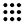

#### Component list:
*  [Annual_Daylight_Simulation](../components/Annual_Daylight_Simulation.md)
*  [Daylight_Factor_Simulation](../components/Daylight_Factor_Simulation.md)
*  [Generate_Test_Points](../components/Generate_Test_Points.md)
*  [Grid_Based_Simulation](../components/Grid_Based_Simulation.md)
*  [Image_Based_Simulation](../components/Image_Based_Simulation.md)
*  [Vertical_Sky_Component](../components/Vertical_Sky_Component.md)
*  [DSParameters](../components/DSParameters.md)
*  [RADParameters](../components/RADParameters.md)
*  [Advanced_Dynamic_Shading_Recipe](../components/Advanced_Dynamic_Shading_Recipe.md)
*  [Ambient_Resolution](../components/Ambient_Resolution.md)
*  [Conceptual_Dynamic_Shading_Recipe](../components/Conceptual_Dynamic_Shading_Recipe.md)
*  [Daysim_Glare_Control_Recipe](../components/Daysim_Glare_Control_Recipe.md)
*  [Daysim_Shading_State](../components/Daysim_Shading_State.md)
*  [Generate_Zone_Test_Points](../components/Generate_Zone_Test_Points.md)