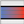

#### Component list:
*  [Set EP Zone Construction](../components/Set_EP_Zone_Construction.md)
*  [Set EnergyPlus Zone Loads](../components/Set_EnergyPlus_Zone_Loads.md)
*  [Set EnergyPlus Zone Schedules](../components/Set_EnergyPlus_Zone_Schedules.md)
*  [Set Loads And Schedules](../components/Set_Loads_And_Schedules.md)
*  [AddEarthtube](../components/AddEarthtube.md)
*  [Create EP Ground](../components/Create_EP_Ground.md)
*  [Create EP Plenum](../components/Create_EP_Plenum.md)
*  [Honeybee Lighting Density Calculator](../components/Honeybee_Lighting_Density_Calculator.md)
*  [Honeybee infORventPerArea Calculator](../components/Honeybee_infORventPerArea_Calculator.md)
*  [Set EP Air Flow](../components/Set_EP_Air_Flow.md)
*  [Set EP Surface Construction](../components/Set_EP_Surface_Construction.md)
*  [Set EP Zone Interior Construction](../components/Set_EP_Zone_Interior_Construction.md)
*  [Set EP Zone Underground Construction](../components/Set_EP_Zone_Underground_Construction.md)
*  [Set EnergyPlus Zone Thresholds](../components/Set_EnergyPlus_Zone_Thresholds.md)