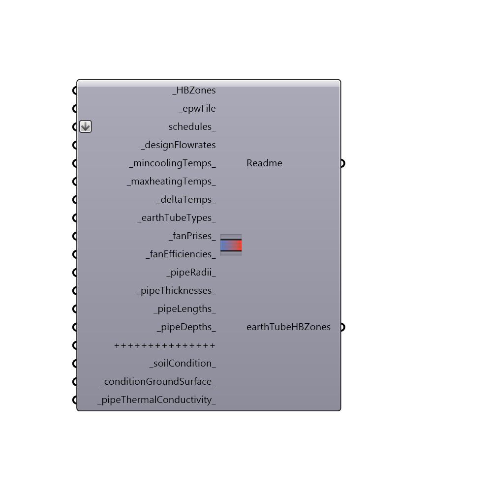

##  AddEarthtube

Use this component to add an Energy Plus earth tube to a Zone.
 An earth tube is a long, underground metal or plastic pipe through which air is drawn. During cooling season, as air travels through the pipe, it gives up some of its heat to the surrounding soil and enters the room as cooler air. Similarly, during heating season, as air travels through the pipe, it receives some of its heat from the soil and enters the room as warmer air. Simple earth tubes in EnergyPlus can be controlled by a schedule and through the specification of minimum, maximum, and delta temperatures as described below. As with infiltration and ventilation, the actual flow rate of air through the earth tube can be modified by the temperature difference between the inside and outside environment and the wind speed. The basic equation used to calculate air flow rate of earth tube in EnergyPlus is:
 EarthTubeFlowRate = E*F*[A+B|Tzone-Todb|+C(Windspeed)+D(Windspeed^2)]
 -
 Where:
 1. E is the maximum amount of air mass flow rate of the earth tube expected at design conditions.
 -
 2. F is the schedule that modifies the maximum design volume flow fraction between 0 and 1.
 -
 3. Tzone is the temperature of the zone which the Earthtube is attached to and Todb is the outdoor dry blub temperature as odb stands for outdoor dry blub temperature.
 -
 4. A,B,C and D are Constant term flow coefficients,Temperature Term flow coefficients, Velocity Term flow coefficients and Velocity squared term flow coefficients respectively they are set at the default values of 0.606,2.0199999E-02,5.9800001E-04 and 0.0000000E+00. In future versions the user will be able to specify these.
 -
 For more information about the Energy Plus Earthtube please see:
 http://bigladdersoftware.com/epx/docs/8-2/input-output-reference/group-airflow.html#zoneearthtube-earth-tube
 -
 

#### Inputs
* ##### HBZones [Required]
The Honeybee zones to which Earthtubes will be added to. Only one earth tube will be added to each zone.
* ##### epwFile [Required]
An .epw file path on your system as a text string. Used to find the ground temperature of the site so Earthtube calculations can be undertaken.
* ##### schedules [Optional]
This field can be a schedule or a list of schedules which correspond sequentially to the _HBZones. If no schedule is given for a zone the default schedule "ALWAYS ON" will be used.
 -
 F is the name of the schedule that modifies the maximum design volume flow rate parameter . This fraction between 0.0 and 1.0 is noted as Fschedule in the EarthTubeFlowRate equation the  .
* ##### designFlowrates [Required]
This field can be a float or a list of floats which correspond sequentially to the _HBZones. Each float (noted as Edesign in the EarthTubeFlowRate equation) is the maximum amount of air mass flow rate of the earth tube expected at design conditions the default is 0 m3/s.
 If no flow rate is given for a zone the default will be used.
 -
 The flow rate is expressed in units of m3/s. The design value is modified by the schedule fraction and user specified coefficients (Open this component to see the equation).
* ##### mincoolingTemps [Default]
This field can be a float or a list of floats which correspond sequentially to the _HBZones.
 -
 Each float is the indoor temperature (in Celsius) below which the earth tube is shut off the default is -100 degrees C. This lower temperature limit is intended to avoid overcooling a space and thus result in a heating load.
 -
 For example, if the user specifies a minimum temperature of 20 C, earth tube is assumed to be available if the zone air temperature is above 20 C. If the zone air temperature drops below 20C, then earth tube is automatically turned off.
 If no temperature is given for a zone the default will be used.
* ##### maxheatingTemps [Default]
This field can be a float or a list of floats which correspond sequentially to the _HBZones. Each float is the indoor temperature (in Celsius) above which the earth tube is shut off the default is 100 degrees C.
 -
 This higher temperature limit is intended to avoid overheating a space and thus result in a cooling load.For example, if the user specifies a maximum temperature of 20 C, earth tube is assumed to be available if the zone air temperature is below 20 C.
 -
 If the zone air temperature rises above 20C, then earth tube is automatically turned off. If no temperature is given for a zone the default will be used.
* ##### deltaTemps [Default]
This field can be a float or a list of floats which correspond sequentially to the _HBZones. Each float is the temperature difference (in Celsius) between the indoor and outdoor air dry-bulb temperatures below which the earth tube is shut off the default is 2 degrees C.
 -
 This is to allow the earth tube to be stopped either if the temperature outside is too warm and could potentially heat the space or if the temperature outside is too cold and could potentially cool the space. For example, if the user specifies a delta temperature of 2C, earth tube is assumed to be available if the temperature difference between indoor and outdoor temperature is at least 2 C
 -
 If the outside air dry-bulb temperature is less than 2C cooler or warmer than the indoor dry-bulb temperature, then the earth tube is automatically turned off.
 If no temperature is given for a zone the default will be used.
* ##### earthTubeTypes [Default]
This field can be integer or a list of integers between 1 and 3 which correspond sequentially to the _HBZones. Each integer from 1 to 3 defines the type of earth tube as one of the following options: Natural a value of 1, Exhaust a value of 2, or Intake a value of 3. 
 -
 A natural earth tube is assumed to be air movement/exchange that will not consume any fan energy or is the result of natural air flow through the tube and into the building. Values for fan pressure and efficiency for a natural flow earth tube are ignored. For either Exhaust or Intake, values for fan pressure and efficiency define the fan electric consumption.
 -
 For Natural and Exhaust earth tubes, the conditions of the air entering the space are assumed to be equivalent to the air which is cooled or heated by passing along the pipe.
 -
 For Intake earth tubes, an appropriate amount of fan heat is added to the air stream. The default is a Natural Earthtube and this will be used if no earth tube type is given for the zone.
* ##### fanPrises [Default]
This field can be a float or a list of floats which correspond sequentially to the _HBZones. Each float is the pressure rise experienced across the fan in Pascals (N/m2) the default is 150 Pascals which will be used if no value is given for a zone.
 -
 This is a function of the fan and plays a role in determining the amount of energy consumed by the fan.
* ##### fanEfficiencies [Default]
This field can be a float or a list of floats between 0 and 1 which correspond sequentially to the _HBZones. Each float is the earth tube fan efficiency which is a decimal number between 0.0 and 1.0 the default is 1 which will be used if no value is given for a zone.
 -
 This is a function of the fan and plays a role in determining the amount of energy consumed by the fan.
* ##### pipeRadii [Default]
This field can be a float or a list of floats which correspond sequentially to the _HBZones. Each float is the radius of the earth tube(in meters) the default is 0.5 meter which will be used if no value is given for a zone. This plays a role in determining the amount of heat transferred from the surrounding soil to the air passing along the pipe. 
 -
 If the pipe has non-circular cross section, user can use the concept of hydraulic diameter where Radius = 2*Area/Perimeter.
* ##### pipeThicknesses [Default]
This field can be a float or a list of floats which correspond sequentially to the _HBZones. Each float is the thickness of the earth tube wall (in meters) the default is 0.2 meters which will be used if no value is given for a zone. 
 -
 This plays a role in determining the amountof heat transferred from the surrounding soil to the air passing along the earth tube.
* ##### pipeLengths [Default]
This field can be a float or a list of floats which correspond sequentially to the _HBZones. Each float is the total length of the pipe (in meters) the default is 15 meters which will be used if no value is given for a zone. 
 -
 This plays a role in determining the amount of heat transferred from the surrounding soil to the air passing along the pipe. As the length of the pipe becomes longer, the amount of the heat transfer becomes larger
* ##### pipeDepths [Default]
This field can be a float or a list of floats which correspond sequentially to the _HBZones. Each float is the depth of the pipe under the ground surface (in meters) the default is 3 meters which will be used if no value is given for a zone. 
 -
 This plays a role in determining the temperature of the soil surrounding the pipe.
* ##### soilCondition [Default]
An integer between 1 to 4 that defines the actual condition of the soil surrounding ALL the earth tubes: HeavyAndSaturated a value of 1, HeavyAndDamp a value of 2, HeavyAndDry a value of 3 or LightAndDry a value of 4. 
 -
 This determines the thermal diffusivity and thermal conductivity of the surrounding soil, which play a role in determining the amount of heat transferred from the surrounding soil to the air passing along ALL the pipes.
 -
 The default is 1 - HeavyAndSaturated.
* ##### conditionGroundSurface [Default]
An integer between 1 to 8 and defines the condition of the ground surface above ALL the earth tubes.
 -
 Bare and wet is a value of 1, Bare and moist is a value of 2, Bare and Arid is a value of 3, Bare and dry is a value of 4, Covered and wet is a value of 5,
 -
 Covered and moist is a value of 6, Covered and arid is a value of 7, Covered and dry is a value of 8 the default is 1 - Bare and wet.
* ##### pipeThermalConductivity [Default]
This field can be a float or a list of floats which correspond sequentially to the _HBZones. Each float is the thermal conductivity of the pipe (in W/m-K) the default is 200 W/m-K. 
 -
 This plays a role in determining the amount of heat transferred from the surrounding soil to the air passing along ALL the earth tubes.

#### Outputs
* ##### Readme
Details of the earth tubes created.
* ##### earthTubeHBZones
The Honeybee zones that have been modified by this component - these zones now contain an earth tube

[Check Hydra Example Files for AddEarthtube](https://hydrashare.github.io/hydra/index.html?keywords=Honeybee_AddEarthtube)