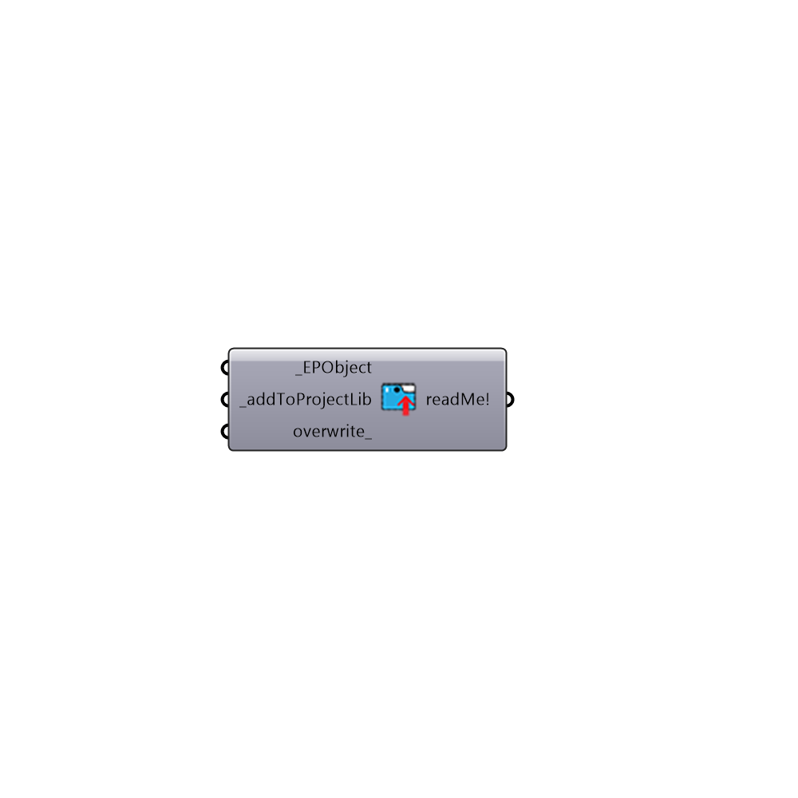

##  Add to EnergyPlus Library - [[source code]](https://github.com/ladybug-tools/honeybee-legacy/tree/master/src/Honeybee_Add%20to%20EnergyPlus%20Library.py)

Add EnergyPlus Material, Construction or Schedule to Library
 -
 

#### Inputs
* ##### EPObject [Required]
EnergyPlus material, construction or schedule definition
* ##### addToProjectLib [Required]
Set to True to add the material to HB library for this project
* ##### overwrite [Optional]
Set to True if you want to overwrite the material with similar name

#### Outputs
* ##### readMe!
...

[Check Hydra Example Files for Add to EnergyPlus Library](https://hydrashare.github.io/hydra/index.html?keywords=Honeybee_Add to EnergyPlus Library)