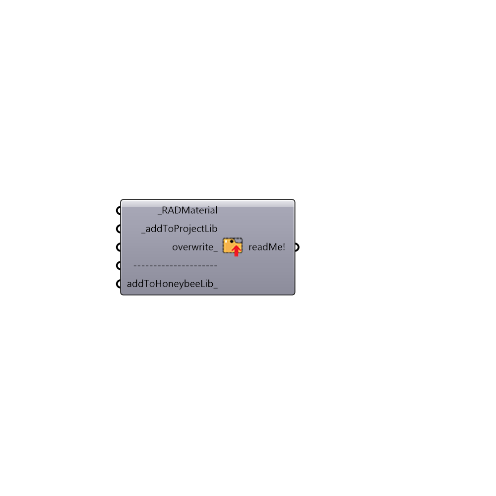

##  Add to Radiance Library

Add Radiance Materials to Library
 -
 

#### Inputs
* ##### RADMaterial [Required]
Radiance material definition
* ##### addToProjectLib [Required]
Set to True to add the material to HB library for this project
* ##### overwrite [Optional]
Set to True if you want to overwrite the material with similar name
* ##### addToHoneybeeLib [Optional]
Set to True to Honeybee material libaray. Materials in addToHoneybeeLib library will be loaded anytime that you let the 'bee fly. You can add the materials manually to C:\ladybug\HoneybeeRadMaterials.mat

#### Outputs
* ##### readMe!
...

[Check Hydra Example Files for Add to Radiance Library](https://hydrashare.github.io/hydra/index.html?keywords=Honeybee_Add to Radiance Library)