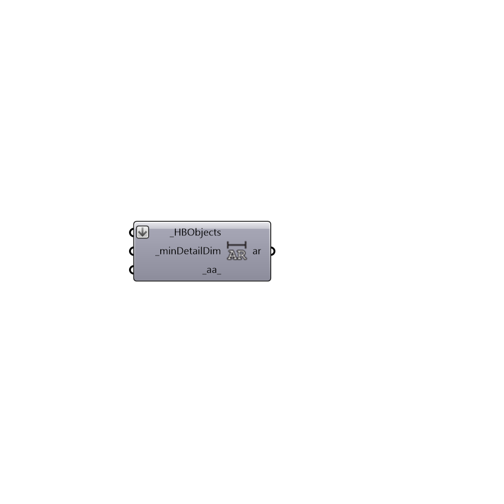

##  Ambient Resolution - [[source code]](https://github.com/mostaphaRoudsari/honeybee/tree/master/src/Honeybee_Ambient%20Resolution.py)

Use this component to calculate the ambient resoluation (ar) needed to resolve a detail of a diven dimension in Rhino model units. The full geometry scene of HBObjects is needed to calculate this number accurately
 The resulting ar from this component can be plugged into the Honeybee_RADParameters component.
 -
 

#### Inputs
* ##### HBObjects [Required]
All of the Honeybee objects that are going to be used in the daylight simulation.
* ##### minDetailDim [Required]
A number in Rhino model units that represents the dimension of the smallest detail that must be resolved in the daylight simulation.
* ##### aa [Default]
An optional number for Ambient Accuracy. This value should be matched between this component and the Honeybee_RADParameters component.  If no value is input here, a default of 0.25 will be used, which is the default low-resolution value for aa.

#### Outputs
* ##### ar
The abmient resolution needed to resolve a detail of the input _minDetailDim.  This can be plugged into the Honeybee_RADParameters component.

[Check Hydra Example Files for Ambient Resolution](https://hydrashare.github.io/hydra/index.html?keywords=Honeybee_Ambient Resolution)