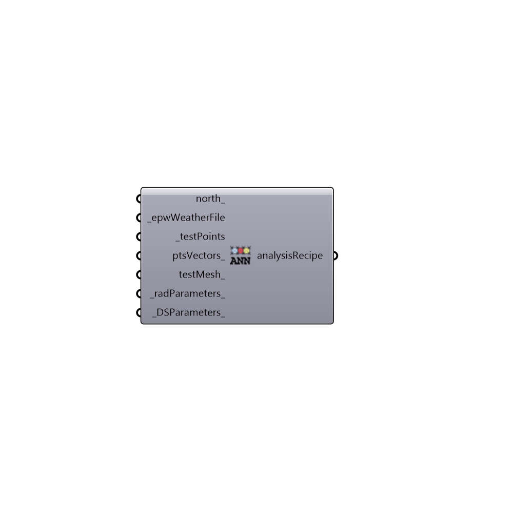

##  Annual Daylight Simulation - [[source code]](https://github.com/ladybug-tools/honeybee-legacy/tree/master/src/Honeybee_Annual%20Daylight%20Simulation.py)

Analysis Recipe for Annual Daylighting Simulation
 -
 

#### Inputs
* ##### north [Optional]
Input a vector to be used as a true North direction for the sun path or a number between 0 and 360 that represents the degrees off from the y-axis to make North.  The default North direction is set to the Y-axis (0 degrees).
* ##### epwWeatherFile [Required]
epw weather file address on your system
* ##### testPoints [Required]
Test points
* ##### ptsVectors [Optional]
Point vectors
* ##### testMesh [Optional]
Script variable annualDaylightSimulation
* ##### radParameters [Default]
Radiance parameters
* ##### DSParameters [Default]
Daysim parameters

#### Outputs
* ##### analysisRecipe
Recipe for annual climate based daylighting simulation

[Check Hydra Example Files for Annual Daylight Simulation](https://hydrashare.github.io/hydra/index.html?keywords=Honeybee_Annual Daylight Simulation)