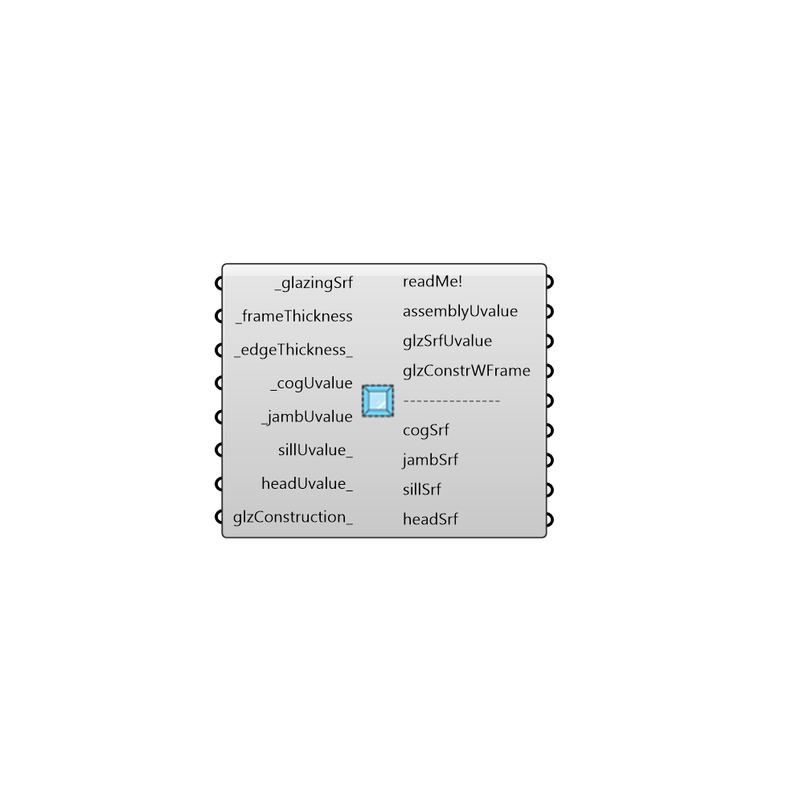

##  Assembly Uvalue - [[source code]](https://github.com/mostaphaRoudsari/honeybee/tree/master/src/Honeybee_Assembly%20Uvalue.py)

Use this component to calculate the assembly U-Value for a window given an input window geometry, center of glass U-value, and frame+edge U-value.  This component can also add a frame to a EnergyPlus window construction that has the glass and spacing information.
 -
 

#### Inputs
* ##### glazingSrf [Required]
A surface representing the window geomtry for which an assebly U-value is being calculated.  This should be the region of glass only (not frame) and it can be the same glazing geometry that is assigned to a Honeybee Zone for an energy simulation.
* ##### frameThickness [Required]
A number in Rhino model units representing the thickness of the window frame around the glazing surface. Specifically, this is the distance from where the glass starts to where the frame ends, projected into the plane of the glazing surface.
* ##### edgeThickness [Default]
A number in Rhino model units that represents the distance from the start of the frame to the start of the 'center of glass' region of the window.  This 'edge of glass' zone typically has a U-Value that is higher than the rest of the glass. The default is set to 63.5 mm.
* ##### cogUvalue [Required]
A number representing the center of glass U-value for the glazing construction in SI units (W/m2-K).
* ##### jambUvalue [Required]
A number representing the U-value of the window frame+edge in SI units (W/m2-K).  If no value is input for the sillUvalue_ or headUvalue_ below, this input here will refer to all window frames of the calculated assembly.  Otherwise, it will refer to just the U-value of the jamb (sides of the window).
* ##### sillUvalue [Optional]
A number representing the U-value of the window sill frame+edge in SI units (W/m2-K).  If no value is input here, this component will assume that the sill U-value is the same as the jamb above.
* ##### headUvalue [Optional]
A number representing the U-value of the window head (top) frame+edge in SI units (W/m2-K).  If no value is input here, this component will assume that the head U-value is the same as the jamb above.
* ##### glzConstruction [Optional]
An optional EnergyPlus window construction to which an EnergyPlus frame object will be added (matching the specification above). It is recommended that this be a construction from LBNL WINDOW that is imported with the "Honeybee_Import WINDOW IDF Report."  If no construction is input here, no glzConstrWFrame will be output from this component.

#### Outputs
* ##### readMe!
...
* ##### assemblyUvalue
The U-Value of the entire window assembly in SI units (W/m2-K).  This U-value is per unit area of glass + frame, which is how assembly U-value is defined by ASHRAE and the building code.
* ##### glzSrfUvalue
The assembly U-value normalized by the area of the input _glzSrf (W/m2-K).  In other words, this U-value is per unit area of glass only (not glass + frame).  This output is what should be plugged into the "Honeybee_EnergyPlus Window Material" component if using the assembly U-value in a Honeybee energy simulation.
* ##### glzConstrWFrame
An EnergyPlus window construction that can be assigned to Honeybee Window Surfaces for EnergyPlus simulations.
* ##### cogSrf
A surface showing the region of the _glazingSrf that is interpreted as the Center of Glass.
* ##### jambSrf
A surface showing the region of the _glazingSrf that is interpreted as the Jamb (or sides of the window).
* ##### sillSrf
A surface showing the region of the _glazingSrf that is interpreted as the Sill.
* ##### headSrf
A surface showing the region of the _glazingSrf that is interpreted as the Head (or top of the window).

[Check Hydra Example Files for Assembly Uvalue](https://hydrashare.github.io/hydra/index.html?keywords=Honeybee_Assembly Uvalue)