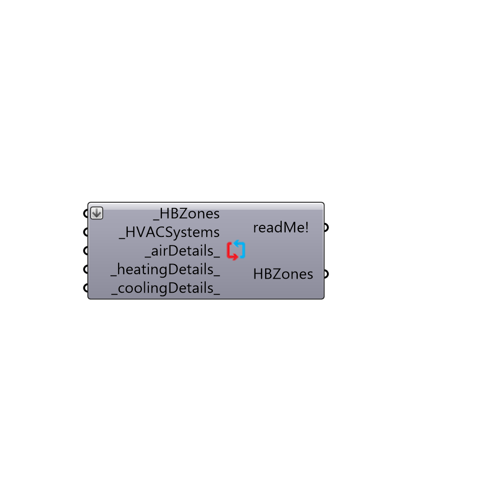

##  Assign HVAC System - [[source code]](https://github.com/ladybug-tools/honeybee-legacy/tree/master/src/Honeybee_Assign%20HVAC%20System.py)

Use this component to assign OpenStudio Systems to your HBZones.  By default, all HBZones are assigned an Ideal Air Loads system and this component can be used to change this to a real system from the OpenStudioHVACSystemsList component.
 This component is also used to adjust the features of the HVAC system using the _airDetails_, _heatingDetails_, and _coolingDetails_.  Without the inputs to these Details, template OpenStudio systems will be used.
 -
 

#### Inputs
* ##### HBZones [Required]
The HBZones for which you want to change/adjust the HVAC system.
* ##### HVACSystems [Required]
A HVAC system template from the "Honeybee_HVACSystemsList" component.  ASHRAE recommends using the following baseline systems for different building types and fuel sources:
 BUILDING TYPE               FOSSIL FUEL/HYBRID/PURCHASED HEAT           ELECTRIC ONLY
 Residential                        1: PTAC | Residential                                                  2: PTHP | Residential
 Non-Res 3 Floors             3: Packaged Single Zone - AC                                   4: Packaged Single Zone - HP
 Non-Res 4-5 Floors          5: Packaged VAV w/ Reheat                                       6: Packaged VAV w/ PFP Boxes
 Non-Res >5 Floors           7: VAV w/ Reheat                                                        8: VAV w/ PFP Boxes
 Heated Only Sotrage         9: Warm Air Furnace - Gas Fired                              10: Warm Air Furnace - Electric
* ##### airDetails [Default]
Parameters from the "Honeybee_HVAC Air Details" component. Use these to define the features of the ventilation component (or air side) of the HVAC system.
* ##### heatingDetails [Default]
Parameters from the "Honeybee_HVAC Heating Details" component.  Use these to define the features of the heating plant (or hot water side) of the HVAC system.
* ##### coolingDetails [Default]
Parameters from the "Honeybee_HVAC Cooling Details" component.  Use these to define the features of the cooling plant (or chilled water side) of the HVAC system.

#### Outputs
* ##### readMe!
Script variable OSHVACSystems
* ##### HBZones
HBZones that have been modified to have the assigned _HVACSystems.

[Check Hydra Example Files for Assign HVAC System](https://hydrashare.github.io/hydra/index.html?keywords=Honeybee_Assign HVAC System)