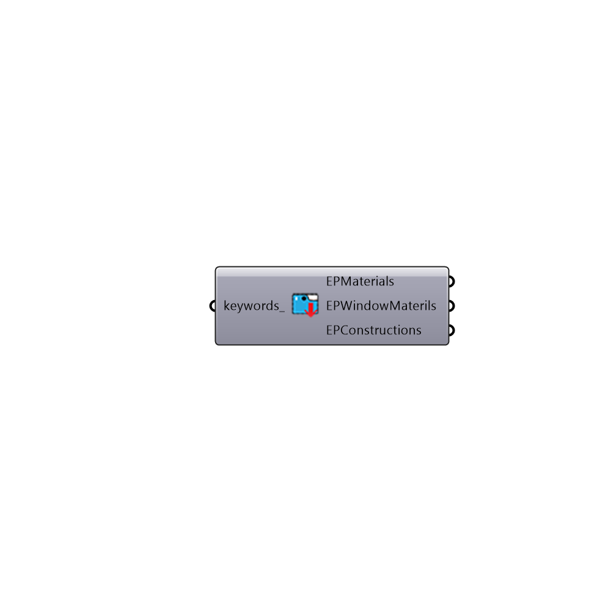

##  Call from EP Construction Library - [[source code]](https://github.com/mostaphaRoudsari/honeybee/tree/master/src/Honeybee_Call%20from%20EP%20Construction%20Library.py)

Call from EP Library
 -
 

#### Inputs
* ##### keywords [Optional]
List of keywords to filter the list of materials

#### Outputs
* ##### ThermMaterials
List of THERM materials in Honeybee library.  Note that Therm materials do not contain enough information to be used for EnergyPlus.  They can only be used for THERM polygons with the "Honeybee_Create Therm Polygons" component.
* ##### EPMaterials
List of EP materials in Honeybee library
* ##### EPWindowMaterials
List of EP window materials in Honeybee library
* ##### EPConstructions
List of EP constructions in Honeybee library

[Check Hydra Example Files for Call from EP Construction Library](https://hydrashare.github.io/hydra/index.html?keywords=Honeybee_Call from EP Construction Library)