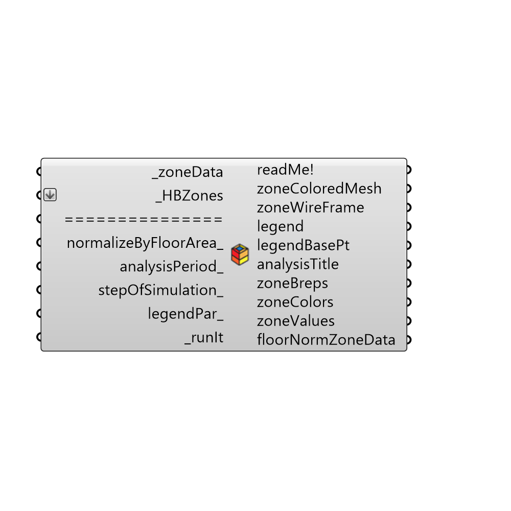

##  Color Zones by EP Result

Use this component to color zones based on EnergyPlus data out of the "Honeybee_Read EP Result" component or zone comfort analyses out of the comfort calculator components.
 _
 By default, zones will be colored based on total energy per unit floor area of the zone in the case of energy input data or colored based on total average value of each zone in the case of temperature, humidity or comfort input data.
 If total annual simulation data has been connected, the analysisPeriod_ input can be used to select out a specific period fo the year for coloration.
 In order to color zones by individual hours/months, connecting interger values to the "stepOfSimulation_" will allow you to scroll though each step of the input data.
 -
 

#### Inputs
* ##### zoneData [Required]
A list zone data out of the Read EP Result component or the comfort calculator components that have zone data hooked up to them.
* ##### HBZones [Required]
The HBZones out of any of the HB components that generate or alter zones.  Note that these should ideally be the zones that are fed into the Run Energy Simulation component or zones read back into Grasshopper from the Import idf component in order to ensure alignment with the EP Result data.
* ##### normalizeByFloorArea [Optional]
Set boolean to 'True' in order to normalize results by the floor area of the zone and set to 'False' to color zones based on total zone values.  The default is set to 'True' such that colored zones communicate energy intensity rather than total energy.  Note that this input will be ignored if connected data is Temperature, Humidity, a Comfort Metric, or EUI (which is already normalized by floor area).
* ##### analysisPeriod [Optional]
Optional analysisPeriod_ to take a slice out of an annual data stream.  Note that this will only work if the connected data is for a full year and the data is hourly.  Otherwise, this input will be ignored. Also note that connecting a value to 'stepOfSimulation_' will override this input.
* ##### stepOfSimulation [Optional]
Optional interger for the hour of simulation to color the zones with.  Connecting a value here will override the analysisPeriod_ input.
* ##### legendPar [Optional]
Optional legend parameters from the Ladybug Legend Parameters component.
* ##### recallHBHive [Optional]
Set to 'True' to recall the zones from the hive each time the input changes and 'False' to simply copy the zones to memory.  Calling the zones from the hive can take some more time but this is necessary if you are making changes to the zones and you want to check them.  Otherwise, if you are just scrolling through attributes, it is nice to set this to 'False' for speed.  The default is set to 'False' for speed.
* ##### runIt [Required]
Set boolean to 'True' to run the component and color the zones.

#### Outputs
* ##### readMe!
...
* ##### zoneColoredMesh
A list of meshes for each zone, each of which is colored based on the input _zoneData.
* ##### zoneWireFrame
A list of curves representing the outlines of the zones.  This is particularly helpful if one wants to scroll through individual zone meshes but still see the outline of the building.
* ##### legend
A legend of the zone colors. Connect this output to a grasshopper 'Geo' component in order to preview the legend spearately in the Rhino scene.
* ##### legendBasePt
The legend base point, which can be used to move the legend in relation to the building with the grasshopper 'move' component.
* ##### analysisTitle
The title of the analysis stating what the zones are being colored with.
* ##### zoneBreps
A list of breps for each zone. This is essentially the same as the _HBZones input. Connecting this output and the following zoneColors to a Grasshopper 'Preview' component will thus allow you to see the zones colored transparently.
* ##### zoneColors
A list of colors that correspond to the colors of each zone.  These colors include alpha values to make them slightly transparent.  Connecting the previous output and this output to a Grasshopper 'Preview' component will thus allow you to see the zones colored transparently.
* ##### zoneValues
The values of the input data that are being used to color the zones.
* ##### floorNormZoneData
The input data normalized by the floor area of it corresponding zone.

[Check Hydra Example Files for Color Zones by EP Result](https://hydrashare.github.io/hydra/index.html?keywords=Honeybee_Color Zones by EP Result)