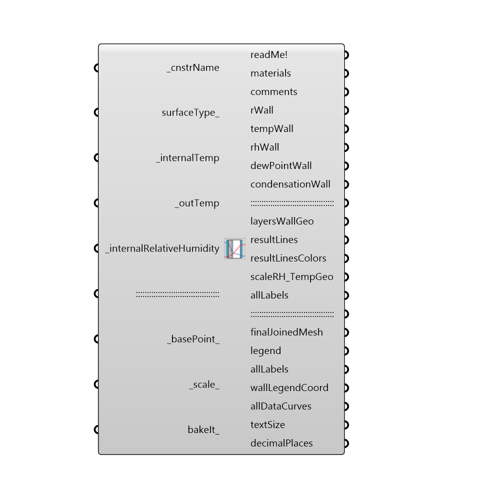

##  Condensation calculator - [[source code]](https://github.com/ladybug-tools/honeybee-legacy/tree/master/src/Honeybee_Condensation%20calculator.py)

Use this component to calculate the Dew Point, Relative Humidity and Condensation on each layer of a wall. It accounts the air films (internal and external).
 Sources:
 http://andrew.rsmas.miami.edu/bmcnoldy/Humidity.html
 http://www.ajdesigner.com/phphumidity/dewpoint_equation_dewpoint_temperature.php#ajscroll
 http://forums.finehomebuilding.com/breaktime/energy-heating-insulation/dewpoint-spreadsheet
 -
 

#### Inputs
* ##### cnstrName [Required]
EnergyPlus construction name
* ##### surfaceType [Optional]
An integer value from 0 to 3 that represents one of the following surface types:
 0 - Exterior Wall/Window
 1 - Exterior Roof
 2 - Exposed Floor
* ##### internalTemp [Required]
Indoors temperature of room
* ##### outTemp [Required]
Outdoors temperature of room
* ##### internalRelativeHumidity [Required]
Indoors relative humidity
* ##### basePoint [Default]
An optional point with which to locate the 3D chart in the Rhino Model.  The default is set to the Rhino origin at (0,0,0).
* ##### scale [Default]
The scale of the surface type section. The default is set to 1.
* ##### bakeIt [Optional]
An integer that tells the component if/how to bake the bojects in the Rhino scene.  The default is set to 0.  Choose from the following options:
 0 (or False) - No geometry will be baked into the Rhino scene (this is the default).
 1 (or True) - The geometry will be baked into the Rhino scene as a colored hatch and Rhino text objects, which facilitates easy export to PDF or vector-editing programs.
 2 - The geometry will be baked into the Rhino scene as colored meshes, which is useful for recording the results of paramteric runs as light Rhino geometry.

#### Outputs
* ##### readMe!
...
* ##### materials
List of materials (from outside to inside). Includes film Air layers. Ordered from Inside to Outside layers. They include Air Films.
* ##### comments
Comments for each layer of materials if any. Ordered from Inside to Outside layers
* ##### rWall
rWall
* ##### tempWall
temperature for each layer in wall (outter edge of layer). Ordered from Inside to Outside layers
* ##### rhWall
relative humdity for each layer in wall (outter edge of layer). Ordered from Inside to Outside layers
* ##### dewPointWall
Dew Point for each layer in wall (outter edge of layer). Ordered from Inside to Outside layers
* ##### condensationWall
State the status of condensation on wall (Yes or No). Ordered from Inside to Outside layers
* ##### layersWallGeo
layersWallGeo
* ##### resultLines
resultLines
* ##### resultLinesColors
resultLinesColors
* ##### scaleRH_TempGeo
scaleRH_TempGeo
* ##### allLabels
allLabels
* ##### finalJoinedMesh
finalJoinedMesh
* ##### legend
legend
* ##### allLabels
Script variable HB_CondensationCalculator
* ##### wallLegendCoord
wallLegendCoord
* ##### allDataCurves
allDataCurves
* ##### textSize
textSize
* ##### decimalPlaces
decimalPlaces

[Check Hydra Example Files for Condensation calculator](https://hydrashare.github.io/hydra/index.html?keywords=Honeybee_Condensation calculator)