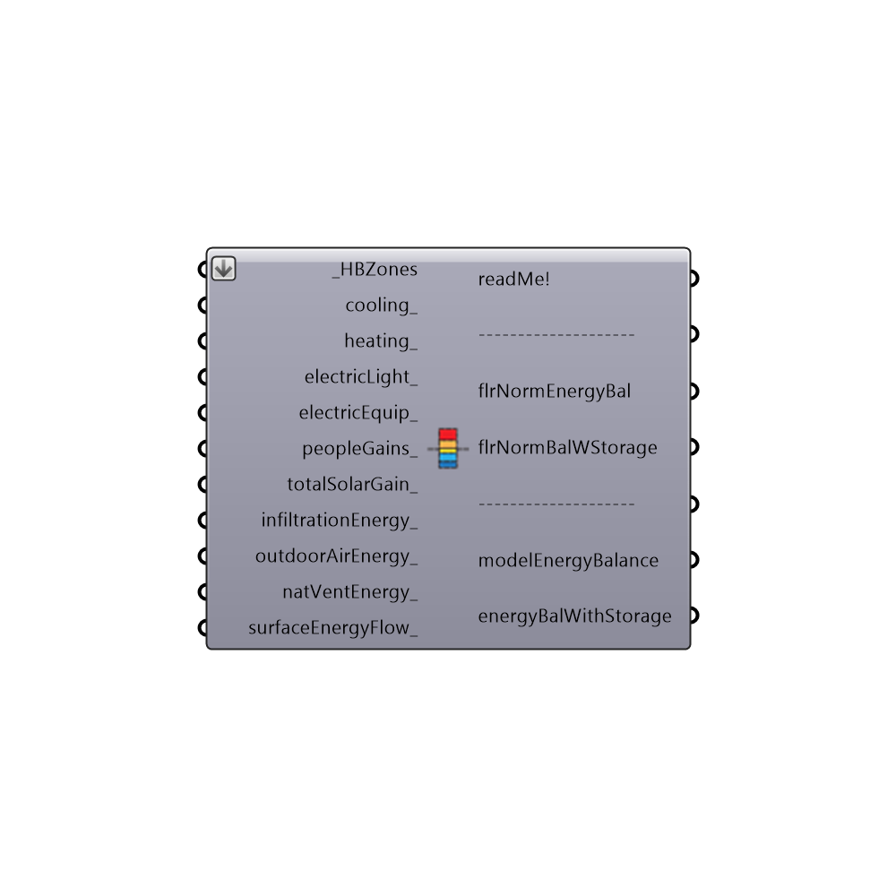

##  Construct Energy Balance - [[source code]](https://github.com/ladybug-tools/honeybee-legacy/tree/master/src/Honeybee_Construct%20Energy%20Balance.py)

This component accepst the outputs of the "Read EP Result" and the "Read EP Surface Result" components and outputs a data tree with all of the building-wide energy balance terms.  This can then be plugged into the "Ladybug_3D Chart" or "Ladybug_Monthly Bar Chart" to give a visualization of the energy balance of the whole model.
 -
 

#### Inputs
* ##### HBZones [Required]
The HBZones out of any of the HB components that generate or alter zones.  Note that these should ideally be the zones that are fed into the Run Energy Simulation component.  Zones read back into Grasshopper from the Import idf component will not align correctly with the EP Result data.
* ##### cooling [Optional]
The cooling load from the "Honeybee_Read EP Result" component.
* ##### heating [Optional]
The heating load from the "Honeybee_Read EP Result" component.
* ##### electricLight [Optional]
The electric lighting load from the "Honeybee_Read EP Result" component.
* ##### electricEquip [Optional]
The electric equipment load from the "Honeybee_Read EP Result" component.
* ##### fanElectric [Optional]
The electric fan load from the "Honeybee_Read EP Result" component.
* ##### peopleGains [Optional]
The people gains from the "Honeybee_Read EP Result" component.
* ##### totalSolarGain [Optional]
The total solar gain from the "Honeybee_Read EP Result" component.
* ##### infiltrationEnergy [Optional]
The infiltration heat loss (negative) or heat gain (positive) from the "Honeybee_Read EP Result" component.
* ##### mechVentilationEnergy [Optional]
The outdoor air heat loss (negative) or heat gain (positive) from the "Honeybee_Read EP Result" component.
* ##### natVentEnergy [Optional]
The natural ventilation heat loss (negative) or heat gain (positive) from the "Honeybee_Read EP Result" component.
* ##### surfaceEnergyFlow [Optional]
The surface heat loss (negative) or heat gain (positive) from the "Honeybee_Read EP Surface Result" component.

#### Outputs
* ##### readMe!
...
* ##### flrNormEnergyBal
A data tree with the important building-wide energy balance terms normalized by floor area.  This can then be plugged into the "Ladybug_3D Chart" or "Ladybug_Monthly Bar Chart" to give a visualization of the energy balance of the whole model.
* ##### flrNormBalWStorage
A data tree with the important building-wide energy balance terms normalized by floor area plus an additional term to represent the energy being stored in the building's mass.  If you have input all of the terms of your energy balance to this component, you storage term should be very small in relation to the other energy balance terms.  Thus, this storage term can be a good way to check whether all of your energy balance terms are accounted for.  This output can then be plugged into the "Ladybug_3D Chart" or "Ladybug_Monthly Bar Chart" to give a visualization of the energy balance of the whole model.
* ##### modelEnergyBalance
A data tree with the important building-wide energy balance terms.  This can then be plugged into the "Ladybug_3D Chart" or "Ladybug_Monthly Bar Chart" to give a visualization of the energy balance of the whole model.
* ##### energyBalWithStorage
A data tree with the important building-wide energy balance terms plus an additional term to represent the energy being stored in the building's mass.  If you have input all of the terms of your energy balance to this component, you storage term should be very small in relation to the other energy balance terms.  Thus, this storage term can be a good way to check whether all of your energy balance terms are accounted for.  This output can then be plugged into the "Ladybug_3D Chart" or "Ladybug_Monthly Bar Chart" to give a visualization of the energy balance of the whole model.

[Check Hydra Example Files for Construct Energy Balance](https://hydrashare.github.io/hydra/index.html?keywords=Honeybee_Construct Energy Balance)