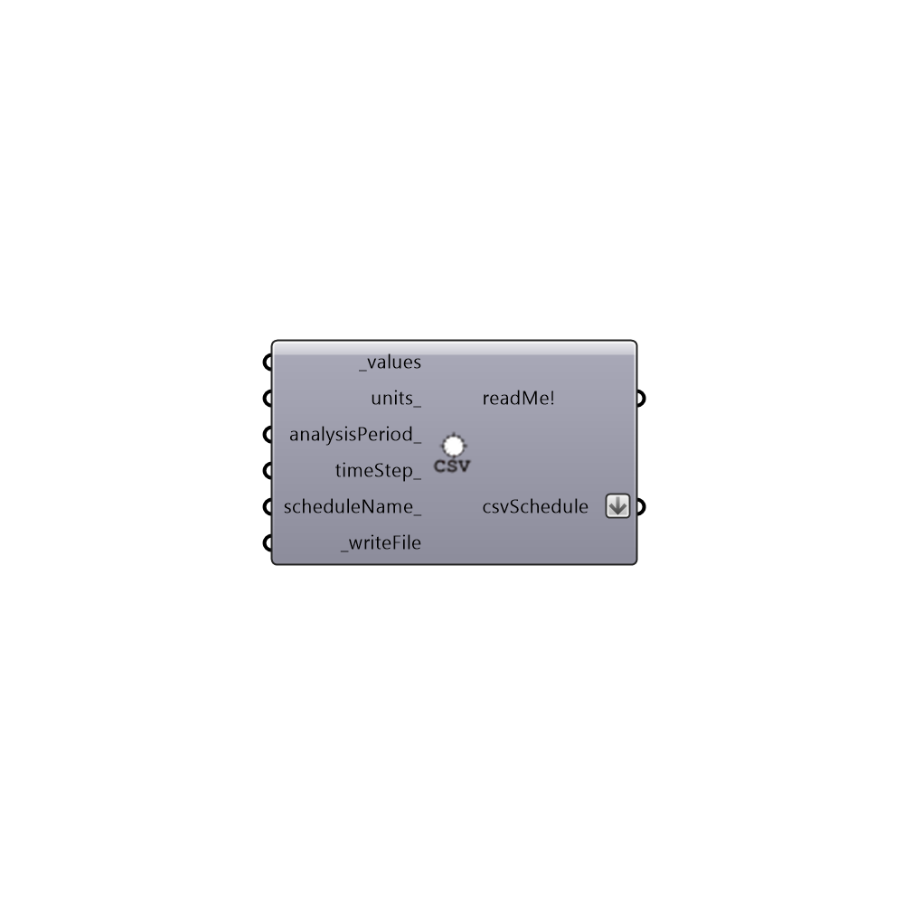

##  Create CSV Schedule - [[source code]](https://github.com/ladybug-tools/honeybee-legacy/tree/master/src/Honeybee_Create%20CSV%20Schedule.py)

Use this component to write custom .csv schedules for EnergyPlus using a list of numbers that you have in grasshopper.  This can be used to make custom infiltration shcedules based on indoor thermal comdort (to mimic opening of windows), shading transparency shedules based on glare or thermal comfort, etc.
 -
 

#### Inputs
* ##### values [Required]
The values to be written into the .csv schedule.
* ##### units [Optional]
Text for the units of the input values above.  The default is "Dimensionless" for a fractional schedule.  Possible inputs include "Dimensionless", "Temperature", "DeltaTemperature", "PrecipitationRate", "Angle", "ConvectionCoefficient", "ActivityLevel", "Velocity", "Capacity", "Power", "Availability", "Percent", "Control", and "Mode".
* ##### analysisPeriod [Optional]
If your input units do not represent a full year, use this input to specify the period of the year that the schedule applies to.
* ##### scheduleName [Required]
Input a name for your schedule here.  The default is "unnamedSchedule".
* ##### writeFile [Required]
Set to "True" to generate the .csv schedule.

#### Outputs
* ##### readMe!
...
* ##### csvSchedule
The file path of the created .csv schedule.  Plug this into the "Honeybee_Set EnergyPlus Zone Schedules" to apply the schedule to a zone.

[Check Hydra Example Files for Create CSV Schedule](https://hydrashare.github.io/hydra/index.html?keywords=Honeybee_Create CSV Schedule)