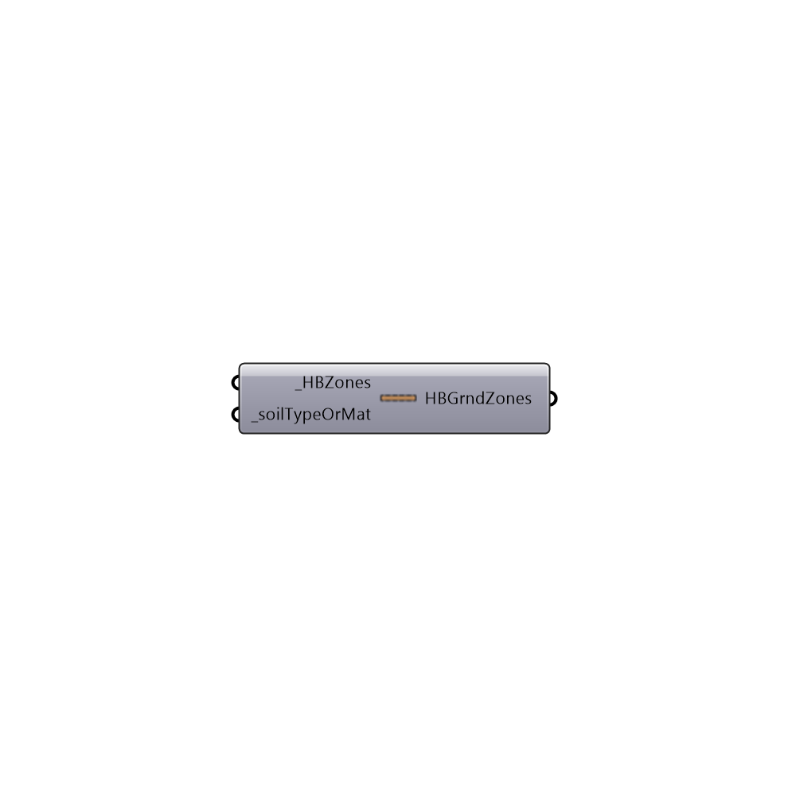

##  Create EP Ground - [[source code]](https://github.com/ladybug-tools/honeybee-legacy/tree/master/src/Honeybee_Create%20EP%20Ground.py)

Use this component to change the properties of a zone to refelct those of a ground.  This is particularly useful for setting up outdoor thermal comfort maps when you want the surface temperature of the ground to be caclated with some spatial diversity, reflecting the shadows that other objects cast upon it and the storage of heat in the ground surface.
 _
 The turning of a zone into a ground zone entails...
 1) Setting all constructions to be indicative of a certain soil type (see the _soilTypeOrMat description for more information).
 2) Setting all surfaces except the roof to have the boundary condition of 'ground', including no sun or wind exposure for these surfaces.
 3) Getting rid of all loads and schedules within the zone.
 _
 All values for soil type are taken from the Engineering Toolbox, specifically these pages below...
 Soil Conductivity - http://www.engineeringtoolbox.com/thermal-conductivity-d_429.html
 Soil Density - http://www.engineeringtoolbox.com/dirt-mud-densities-d_1727.html
 Soil Heat Capacity - http://www.engineeringtoolbox.com/specific-heat-capacity-d_391.html
 -
 

#### Inputs
* ##### HBZones [Required]
HBZones to be turned into ground zones, representative of soil.
* ##### soilTypeOrMat [Required]
Either a material definition output from the 'Honeybee_EnergyPlus Opaque Material' component, the name of a material already in the library, or an integer from 0 to 6 representing the following:
 0 - Dry sand
 1 - Semi-dry sand or dust
 2 - Moits soil
 3 - Mud or soil saturated with water
 4 - Concrete
 5 - Asphalt
 6 - Solid rock or granite

#### Outputs
* ##### HBGrndZones
HBZones that have had their properties altered to be ground conditions.

[Check Hydra Example Files for Create EP Ground](https://hydrashare.github.io/hydra/index.html?keywords=Honeybee_Create EP Ground)