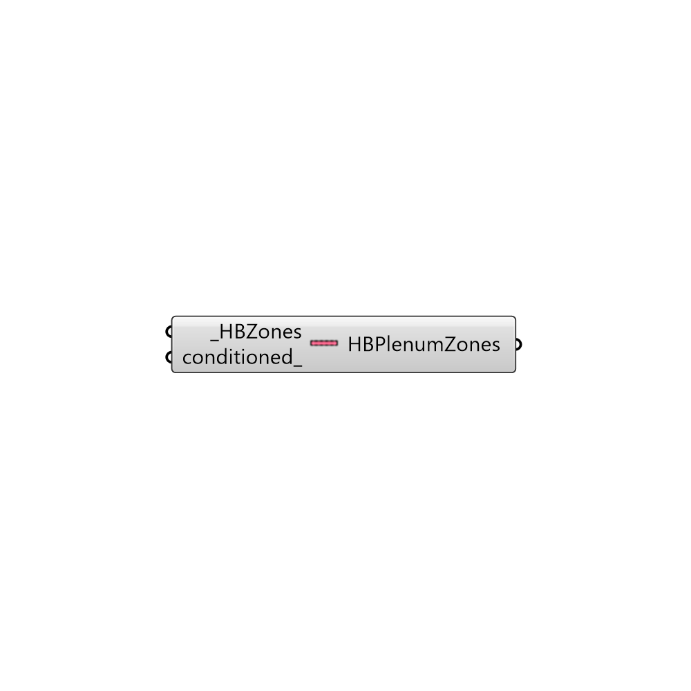

##  Create EP Plenum

Use this component to turn a HBZone into a 'Plenum Zone' with no internal loads.  This is useful to appropriately assign conditions for closets, underfloor spaces, and drop ceilings.
 -
 

#### Inputs
* ##### HBZones [Required]
HBZones that you want to turn into plenum zones.
* ##### conditioned [Optional]
Set to 'True' if the plenum is active or is conditioned and set to 'False' to have the plenum be unconditioned.  The default is set to 'False' to have the zones unconditioned.

#### Outputs
* ##### HBPlenumZones
...

[Check Hydra Example Files for Create EP Plenum](https://hydrashare.github.io/hydra/index.html?keywords=Honeybee_Create EP Plenum)