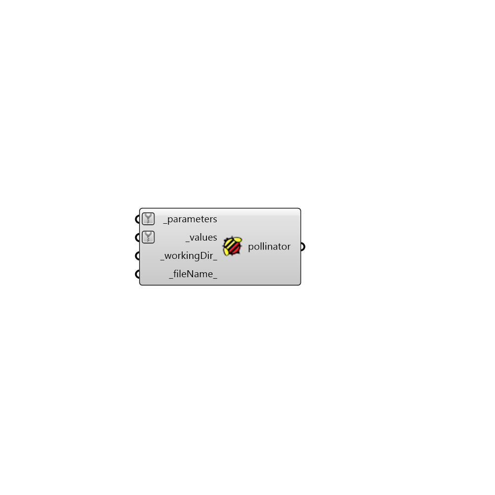

##  Create Pollinator

Craet Pollinator (Put parametric results together)
 -
 

#### Inputs
* ##### parameters [Required]
Input and output parameters in separate branches
* ##### values [Required]
List of values for each input or output parameter
* ##### workingDir [Default]
Optional workingDir
* ##### fileName [Default]
Optional filename

#### Outputs
* ##### pollinator
.csv file that can be loaded and visualized in Pollination.
 Use OpenPollination to open pollination web page.

[Check Hydra Example Files for Create Pollinator](https://hydrashare.github.io/hydra/index.html?keywords=Honeybee_Create Pollinator)