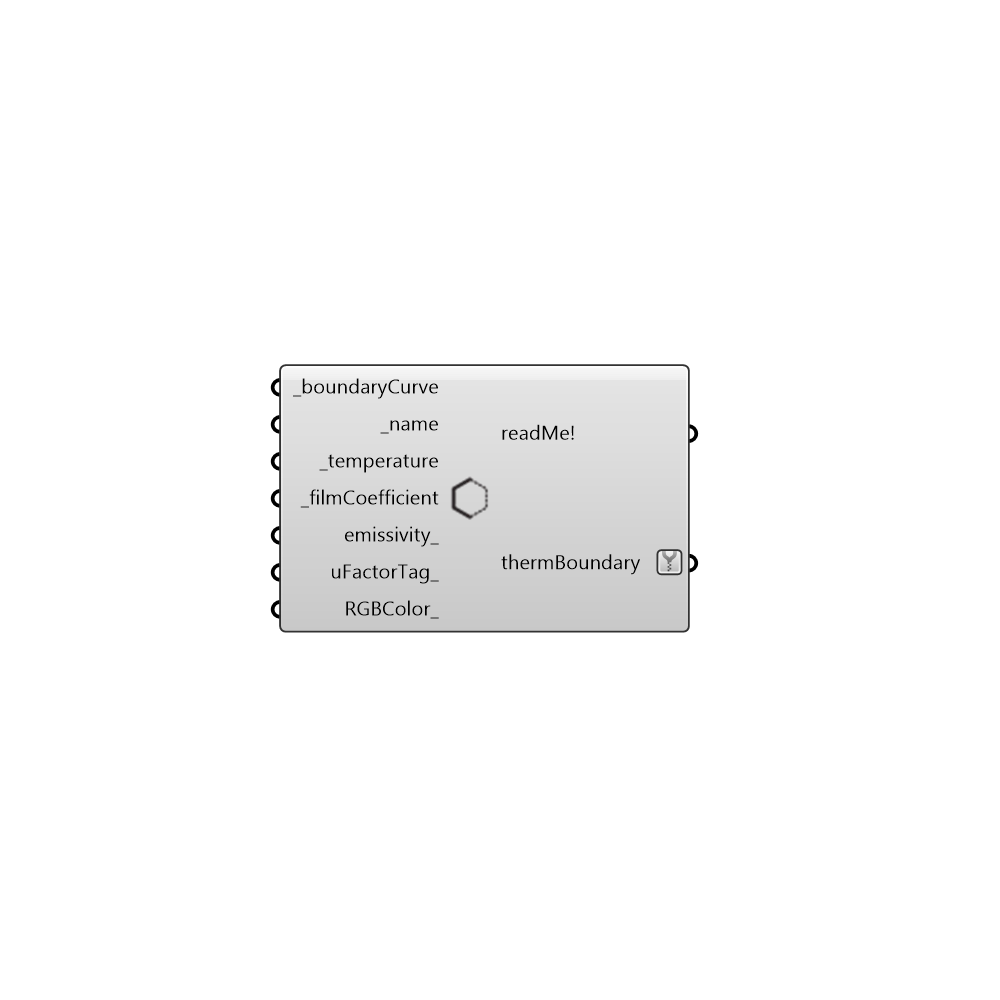

##  Create Therm Boundaries - [[source code]](https://github.com/mostaphaRoudsari/honeybee/tree/master/src/Honeybee_Create%20Therm%20Boundaries.py)

Use this component to create a THERM boundary condition.
 -
 

#### Inputs
* ##### boundaryCurve [Required]
A polyline or list of polylines that coincide with the thermPolygons that you plan to connect to the "Write Therm File" component.
* ##### name [Required]
An name for the boundary condition to keep track of it through the creation of the THERM model.  If no value is input here, a default unique name will be generated.
* ##### temperature [Required]
A numerical value that represents the temperature at the boundary in degrees Celcius.
* ##### filmCoefficient [Required]
A numerical value in W/m2-K that represents the convective resistance of the air film at the boundary condition.  Alternatively, you can simply input the word 'indoor' or 'outdoor' to have the film coefficient autocalculated based on the position of geometry in the Rhino scene and an interpolation of values from Table 10 from chapter 26 of ASHRAE Fundementals 2013.
 _
 Typical film coefficient values range from 36 W/m2-K (for an exterior condition where outdoor wind strips away most convective resistance) to 2.5 W/m2-K (for a vertically-oriented interior wood/vinyl surface).
 _
 Note that, when inputting 'outdoor', the component will assume an outdoor wind speed of ~4.5 m/s (and a corresponding film coefficient of 26 W/m2-K). You may want to simulate with a lower wind speed of 3.4 m/s (filmCoefficient = 22.7 W/m2-K) or a higher wind speed of 6.7 m/s (filmCoefficient = 34.0 W/m2-K).
* ##### emissivity [Optional]
An optional number between 0 and 1 to set an override for the emissivity along the boundary.  By default, the Grasshopper components will take the emissivity of the material that is adjacent to the boundary.  However, a value here can over-ride this value to account for coatings like those on Low-E glass or matte paint on metallic materials.
* ##### customRadEnv [Optional]
A list of radiant environmental properties from the 'Honeybee_Custom Radiant Environment' component.  Inputting values here will create a radiant environment that is different than typical NFRC conditions.
* ##### uFactorTag [Optional]
An optional text string to define a U-Factor tag for the boundary condition.  U-Factor tags are used tell THERM the boundary on which you would like to compute a U-Value.  The default is set to to have no U-Factor tag.  This input can be any text string.  For example "Frame", "Edge", or "Spacer."
* ##### RGBColor [Optional]
An optional color to set the color of the boundary condition when you import it into THERM.

#### Outputs
* ##### readMe!
...
* ##### thermBoundary
A polyline with the specified boudary condition properties, to be plugged into the "boundaries" input of the "Write Therm File" component.

[Check Hydra Example Files for Create Therm Boundaries](https://hydrashare.github.io/hydra/index.html?keywords=Honeybee_Create Therm Boundaries)