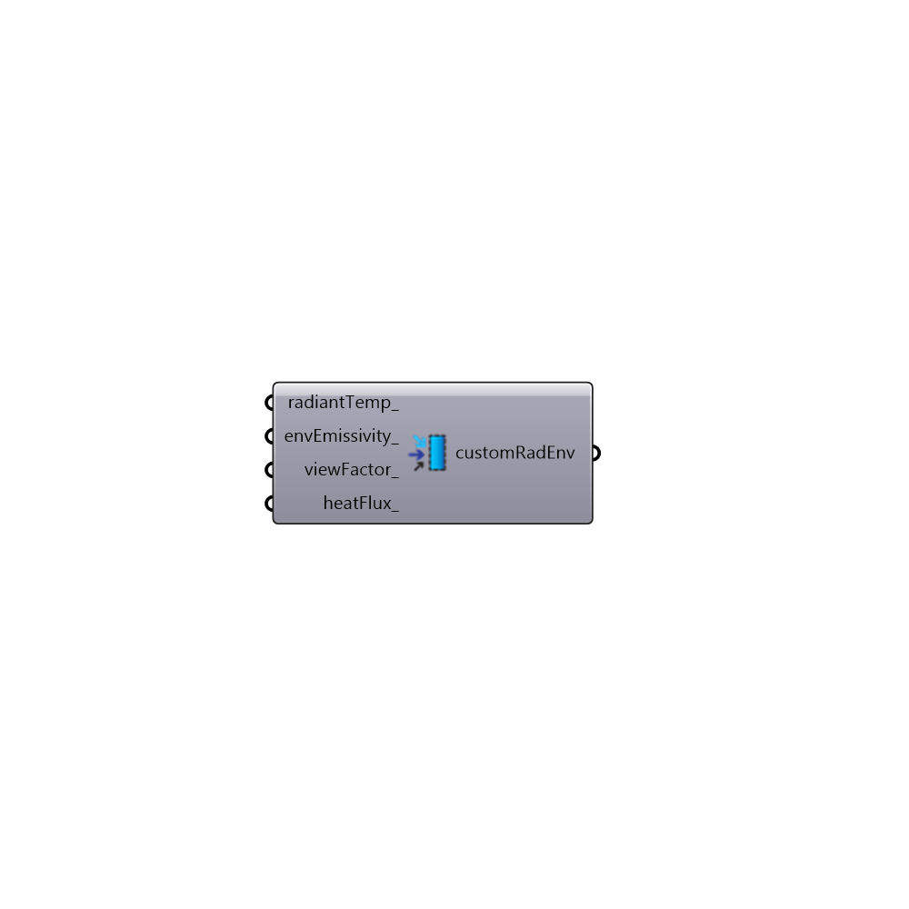

##  Custom Radiant Environment - [[source code]](https://github.com/mostaphaRoudsari/honeybee/tree/master/src/Honeybee_Custom%20Radiant%20Environment.py)

Use this component to create a custon radiant environment for THERM boundary condition.  Assigning values here will create radiant conditions that are different from normal NFRC conditions (where radiant temperature equals air temperature, the emissivity of the environment is assumed to be 1, and viewFactor between the boundary and the envrionment is calculated using the geometry of the boundary).
 -
 

#### Inputs
* ##### radiantTemp [Optional]
A value in degrees Celcius that represents the radiant temperature of the environment.  If no value is plugged in here, the radiant environment will be assumed to have the same temperature as the air.
* ##### envEmissivity [Optional]
A value between 0 and 1 that represents the emissivity of the environment. Use this ti account for environments made of atypical materials like metals. If no value is plugged in here, it will be assumed that the envrionment has an emissivity of 1.
* ##### viewFactor [Optional]
An optional value between 0 and 1 that sets the view factor of the boundary to the surrounding exterior/interior environment.
 _
 Alternatively, you can simply input the word 'auto' and the view factor will be calculated using THERM's 'Automatic Enclosure' model, which will check the geometry of the boundary condition to see if the boundary is concave (meaning that the boundary blocks some of the view of itself to the environment).
 _
 If a view factor number is connected here, THERM's 'Blackbody Radiation' model will be used and the view factor specified will determine the radiative heat transfer.  A view factor of 1 implies that all edges of the boundary can see 100% of the exterior environment.
 _
 If this is left blank, the 'Automatic Enclosure' model will be used any time an indoor film coefficient is specified (< 10 W/m2K).  A 'Blackbody Radiation' model with a view factor of 1 will be used for all outdoor film coefficients (> 10 W/m2K).  These default boundary conditions assume compliance with the NFRC standard.
* ##### heatFlux [Optional]
An optional numerical value in W/m2 that represents additional energy flux across the boundary condition. You can use this to account for solar flux across the exterior boundary condition.

#### Outputs
* ##### customRadEnv
A list of radiant environmental properties that can be plugged into the 'Honeybee_Create Therm Boundaries' component in order to run a THERM simulation with a atypical radiant environment.

[Check Hydra Example Files for Custom Radiant Environment](https://hydrashare.github.io/hydra/index.html?keywords=Honeybee_Custom Radiant Environment)