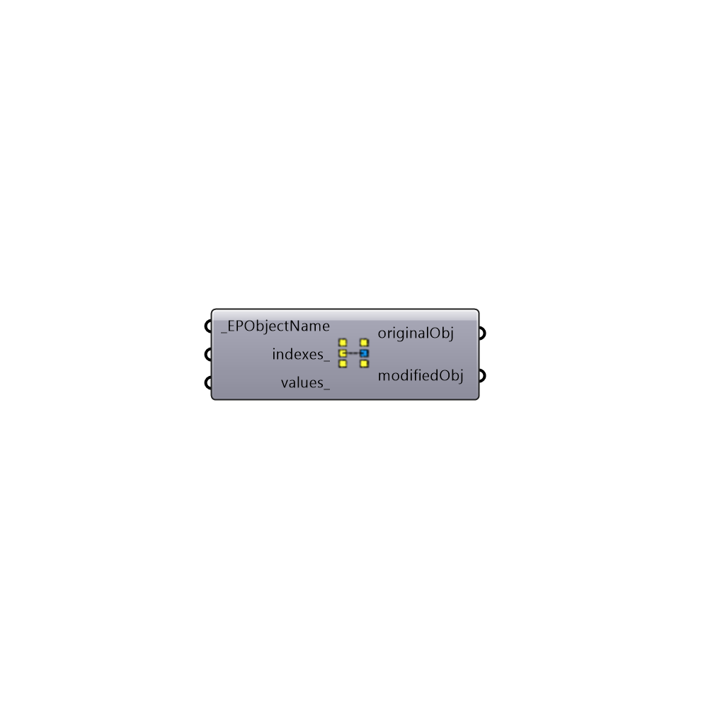

##  Customize EnergyPlus Objects - [[source code]](https://github.com/ladybug-tools/honeybee-legacy/tree/master/src/Honeybee_Customize%20EnergyPlus%20Objects.py)

Customize EnergyPlus Objects [NOT READY YET!]
 -
 

#### Inputs
* ##### EPObjectName [Required]
Script variable Python
* ##### indexes [Optional]
Script variable Python
* ##### values [Optional]
Script variable Python

#### Outputs
* ##### originalObj
Script variable Python
* ##### modifiedObj
Script variable Python

[Check Hydra Example Files for Customize EnergyPlus Objects](https://hydrashare.github.io/hydra/index.html?keywords=Honeybee_Customize EnergyPlus Objects)