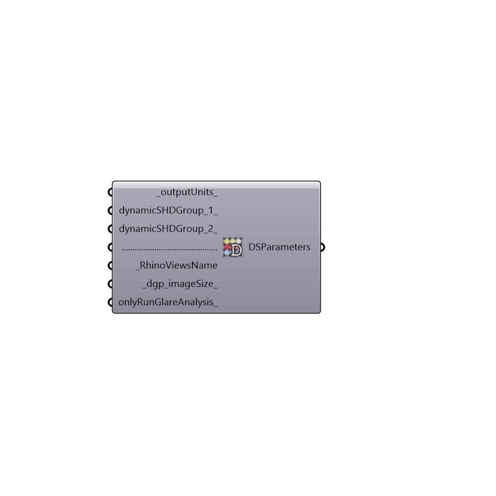

##  DSParameters

Analyses Recipe for Annual Daylight Simulation with Daysim
 -
 

#### Inputs
* ##### outputUnits [Default]
A list of numbers to indicate output units for test points. Defualt is 2. [1] solar irradiance (W/m2), [2] illumiance (lux) - Default is 2
* ##### dynamicSHDGroup_1 [Optional]
Script input dynamicSHDGroup_1.
* ##### dynamicSHDGroup_2 [Optional]
Script input dynamicSHDGroup_2.
* ##### RhinoViewsName [Required]
List of view names that you want to be considered for annual glare analysis. Be aware that annual glare analysis with Daysim can take hours to days!
* ##### dgp_imageSize [Default]
The size of the image to be used for daylight glare probability in pixels. Defult value is 250 px.
* ##### onlyRunGlareAnalysis [Optional]
Set to False if you want the component run both annual glare analysis and calculate annula illuminance levels. Default is True.

#### Outputs
* ##### DSParameters
Script output DSParameters.

[Check Hydra Example Files for DSParameters](https://hydrashare.github.io/hydra/index.html?keywords=Honeybee_DSParameters)