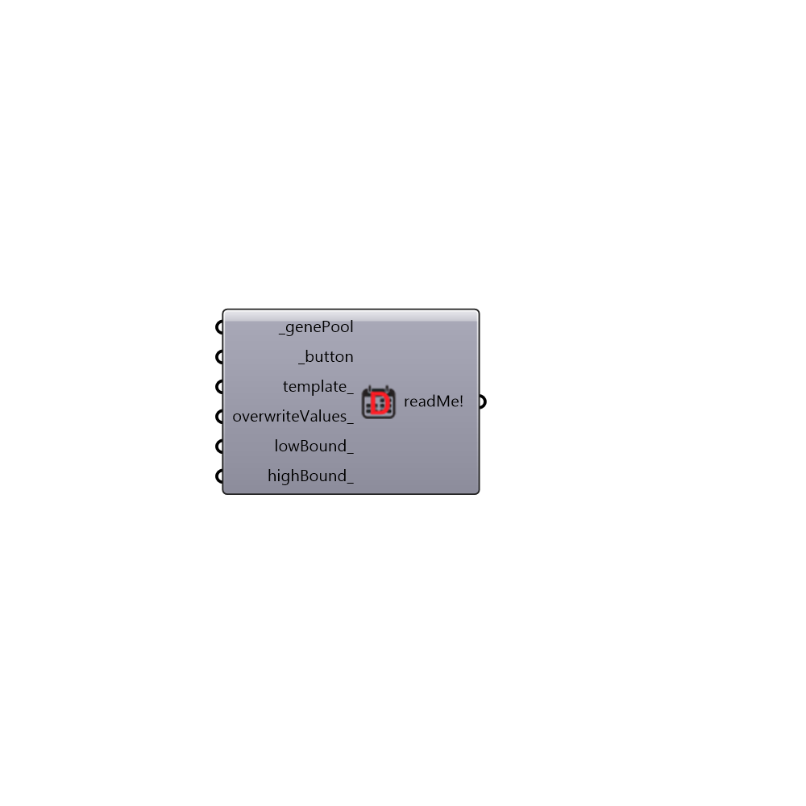

##  Daily Schedule - [[source code]](https://github.com/ladybug-tools/honeybee-legacy/tree/master/src/Honeybee_Daily%20Schedule.py)

Use this component to make daily schedules for "Honeybee_AnnualSchedule". This component works with the native Grasshopper Gene Pool.
 -
 

#### Inputs
* ##### genePool [Required]
Input Galapagos Gene Pool
* ##### button [Required]
Connect a button (Params/Input)
* ##### template [Optional]
Choose one of the templates:
 -
 0 - minimum values from 1:00 to 6:00 and from 23:00 to 24:00
 maximum values from 7:00 to 22:00
 -
 1 - minimum values from 7:00 to 22:00
 maximum values from 1:00 to 6:00 and from 23:00 to 24:00
 -
 2 - minimum values from 1:00 to 24:00
 -
 3 - maximum values from 1:00 to 24:00
* ##### overwriteValues [Optional]
Change the maximum and minimum values of the template without modifying the schedule range.
 -
 Connect a list of two numbers.
* ##### lowBound [Optional]
A number representing the lower boundary of the schedule range.  The default is set to 0.
* ##### highBound [Optional]
A number representing the higher boundary of the schedule range. The default is set to 1.

#### Outputs
* ##### readMe!
...

[Check Hydra Example Files for Daily Schedule](https://hydrashare.github.io/hydra/index.html?keywords=Honeybee_Daily Schedule)