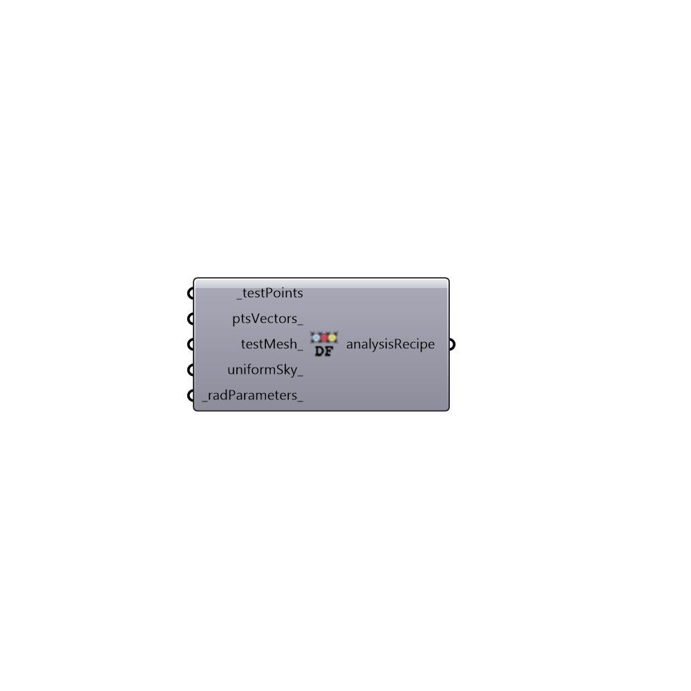

##  Daylight Factor Simulation - [[source code]](https://github.com/ladybug-tools/honeybee-legacy/tree/master/src/Honeybee_Daylight%20Factor%20Simulation.py)

Analysis Recipie for Daylight Factor Analysis
 -
 

#### Inputs
* ##### testPoints [Required]
Test points
* ##### ptsVectors [Optional]
Point vectors
* ##### testMesh [Optional]
Script variable daylighFactorSimulation
* ##### uniformSky [Optional]
Set to true to run the study under a CIE uniform sky. Default is set to cloudy sky
* ##### radParameters [Default]
Radiance parameters

#### Outputs
* ##### analysisRecipe
Recipe for daylight factor analysis

[Check Hydra Example Files for Daylight Factor Simulation](https://hydrashare.github.io/hydra/index.html?keywords=Honeybee_Daylight Factor Simulation)