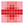
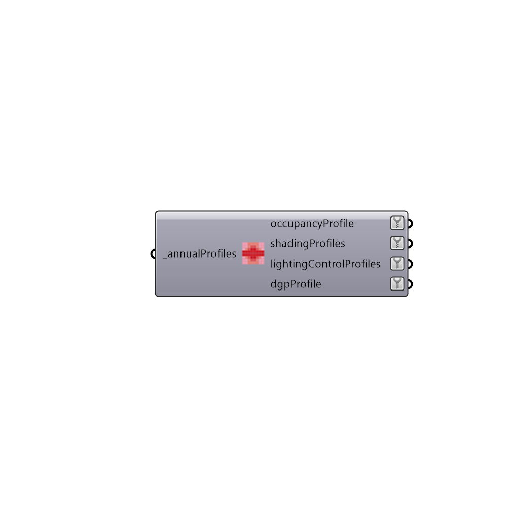

##  Daysim Annual Profiles - [[source code]](https://github.com/ladybug-tools/honeybee-legacy/tree/master/src/Honeybee_Daysim%20Annual%20Profiles.py)

Read Daysim Annual Profiles
 -
 

#### Inputs
* ##### annualProfiles [Required]
Address to a valid *_intgain.csv generated by daysim.

#### Outputs
* ##### occupancyProfile
Lists of annual occupancy profiles if any
 shadingProfiles Lists of annual shading profiles if any
* ##### shadingProfiles
Script output shadingProfiles.
* ##### lightingControlProfiles
Lists of annual lighting switch profiles if any
* ##### dgpProfile
Lists of annual daylight glare probability profiles if any

[Check Hydra Example Files for Daysim Annual Profiles](https://hydrashare.github.io/hydra/index.html?keywords=Honeybee_Daysim Annual Profiles)