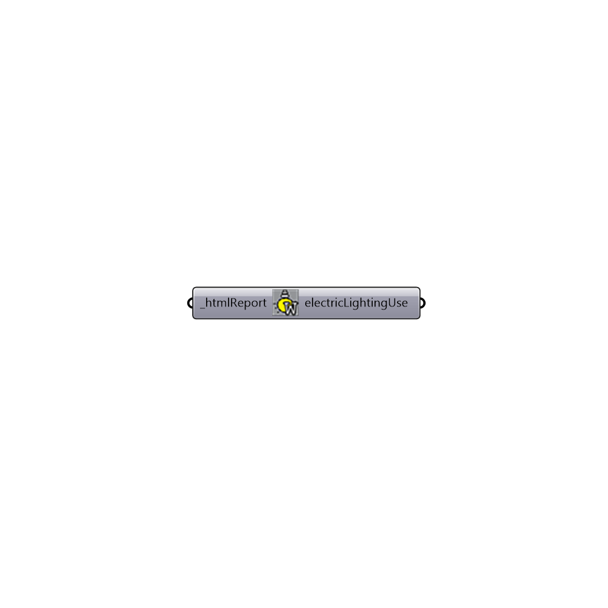

##  Daysim Electrical Lighting Use - [[source code]](https://github.com/mostaphaRoudsari/honeybee/tree/master/src/Honeybee_Daysim%20Electrical%20Lighting%20Use.py)

Daysim's electrical lighting use
 -
 

#### Inputs
* ##### htmlReport [Required]
Address to a valid .htm file generated by daysim.

#### Outputs
* ##### electricLightingUse
Lists of annual occupancy profiles if any

[Check Hydra Example Files for Daysim Electrical Lighting Use](https://hydrashare.github.io/hydra/index.html?keywords=Honeybee_Daysim Electrical Lighting Use)