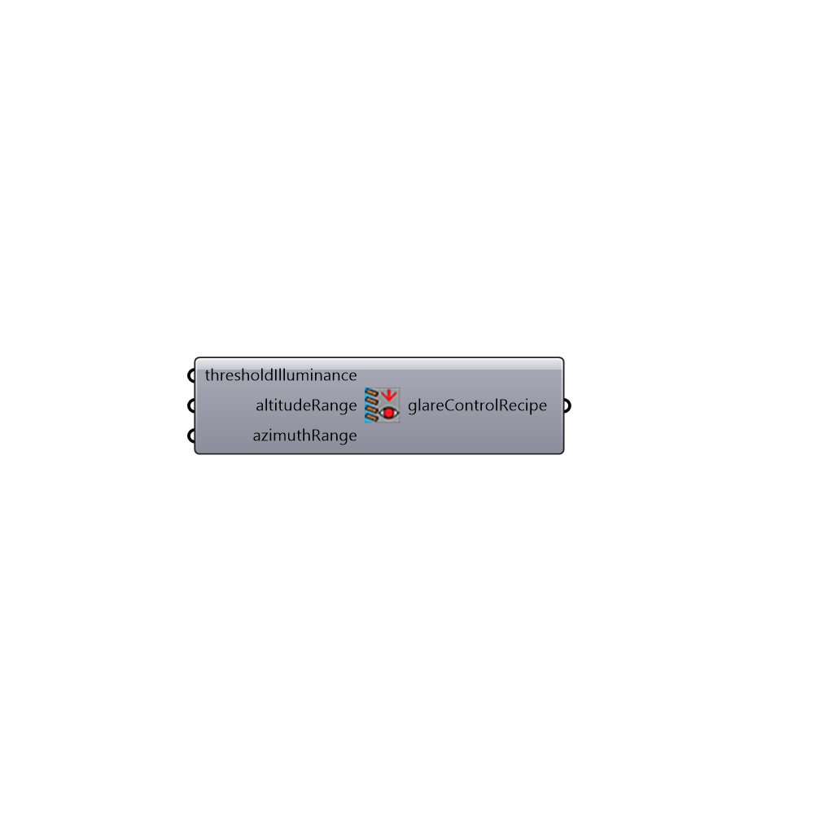

##  Daysim Glare Control Recipe

Glare Control Recipe for Annual Simulation with Daysim "Based on exterior illuminance and/or position of the sun"
 You need to add an external sensor later in the Daysim result reader.
 -
 

#### Inputs
* ##### thresholdIlluminance []
Threshold illuminance in lux to close the blind
* ##### altitudeRange []
Range of sun altitude that the blind should be closed as a Domain.
* ##### azimuthRange []
Range of sun azimuth that the blind should be closed as a Domain.

#### Outputs
* ##### glareControlRecipe
Recipe for glare control

[Check Hydra Example Files for Daysim Glare Control Recipe](https://hydrashare.github.io/hydra/index.html?keywords=Honeybee_Daysim Glare Control Recipe)