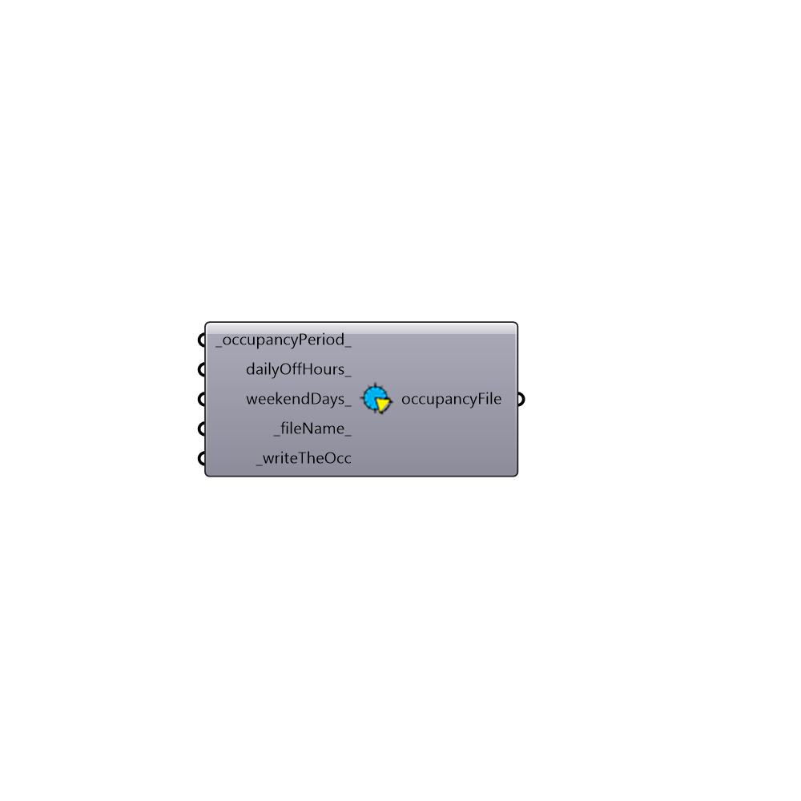

##  Daysim Occupancy Generator

Daysim Occupancy Generator
 Daysim calculates the outputs for the hours that the space is occupied. This componet generates a csv file that will be used as the occupancy-file. Read more here: http://daysim.ning.com/page/keyword-occupancy-profile 
 -
 

#### Inputs
* ##### occupancyPeriod [Default]
The period that the building is actively occupid. Use Ladybug Analysis Period component to generate the input. Default is all year between 9 to 5.
* ##### dailyOffHours [Optional]
A list of hours that building is unoccupied during the occupancy period everyday (e.g. lunch break). Default is an hour lunch break at 12. If you don't want any off hours input -1.
* ##### weekendDays [Optional]
A list of numbers to indicate the weekend days. [0] None, [1-7] SAT to FRI. Default is 1,2 (SAT, SUN)
* ##### fileName [Default]
Optional fileName for this schedule. Files will be saved to C:\Honeybee\DaysimOcc
* ##### writeTheOcc [Required]
Set to True to write the file

#### Outputs
* ##### occupancyFile
Path to occupancy file

[Check Hydra Example Files for Daysim Occupancy Generator](https://hydrashare.github.io/hydra/index.html?keywords=Honeybee_Daysim Occupancy Generator)