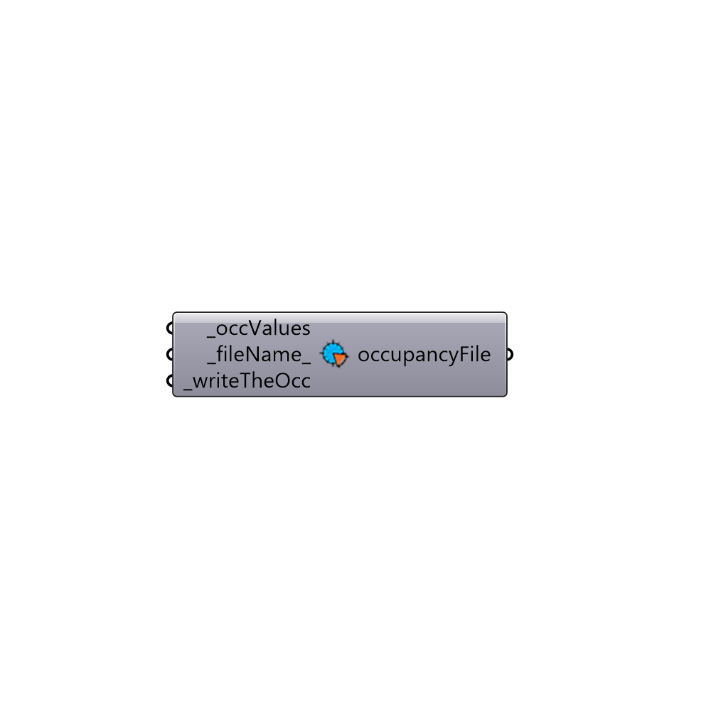

##  Daysim Occupancy Generator Based On List

Daysim Occupancy Generator
 Daysim calculates the outputs for the hours that the space is occupied. This componet generates a csv file based on user input that will be used as the occupancy-file. Read more here: http://daysim.ning.com/page/keyword-occupancy-profile 
 You can use this component to generate a Daysim schedule based of EnergyPlus schedule.
 -
 

#### Inputs
* ##### occValues [Required]
A list of 0 and 1 that indicates the occupancy schedule. The length of the list should be equal to 8760. 
* ##### fileName [Default]
Optional fileName for this schedule. Files will be saved to C:\Honeybee\DaysimOcc
* ##### writeTheOcc [Required]
Set to True to write the file

#### Outputs
* ##### occupancyFile
Path to occupancy file

[Check Hydra Example Files for Daysim Occupancy Generator Based On List](https://hydrashare.github.io/hydra/index.html?keywords=Honeybee_Daysim Occupancy Generator Based On List)