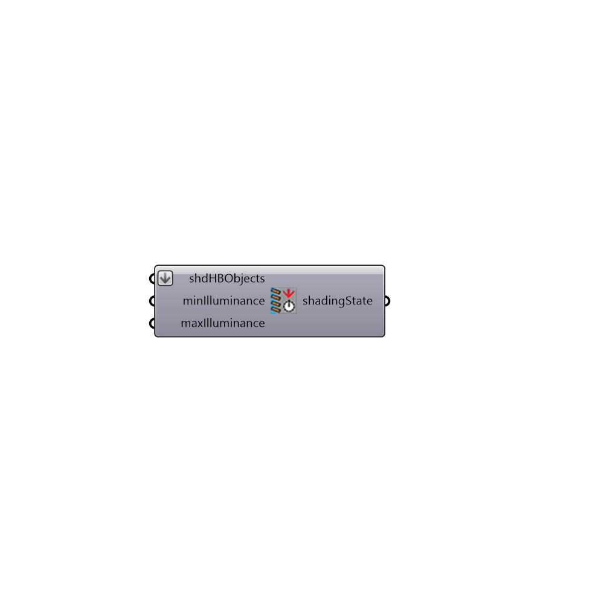

##  Daysim Shading State - [[source code]](https://github.com/ladybug-tools/honeybee-legacy/tree/master/src/Honeybee_Daysim%20Shading%20State.py)

Daysim Shading State for Advanced Dynamic Shading
 -
 

#### Inputs
* ##### shdHBObjects []
A list of HB Objects that define the shading geometry and materials
* ##### minIlluminance []
Optional minimum illuminance in lux to open the blind. If you want the blinds to be manually controlled leave this input empty.
* ##### maxIlluminance []
Optional maximum illuminance in lux to close the blind. If you want the blinds to be manually controlled leave this input empty.

#### Outputs
* ##### shadingState
Shading state

[Check Hydra Example Files for Daysim Shading State](https://hydrashare.github.io/hydra/index.html?keywords=Honeybee_Daysim Shading State)