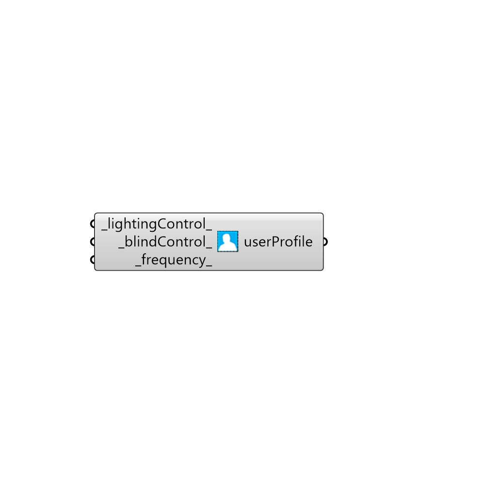

##  Daysim User Profiles - [[source code]](https://github.com/mostaphaRoudsari/honeybee/tree/master/src/Honeybee_Daysim%20User%20Profiles.py)

Daysim User Profiles
 Read here for details: http://daysim.ning.com/page/daysim-header-file-keyword-user-profile
 -
 

#### Inputs
* ##### lightingControl [Default]
0 > Passive, 1 > active
* ##### blindControl [Default]
0 > Passive, 1 > active, 3 > based on daylight glare probability
* ##### frequency [Default]
Frequency of the year that this user type will use the space.

#### Outputs
* ##### userProfile
Daysim user profile

[Check Hydra Example Files for Daysim User Profiles](https://hydrashare.github.io/hydra/index.html?keywords=Honeybee_Daysim User Profiles)