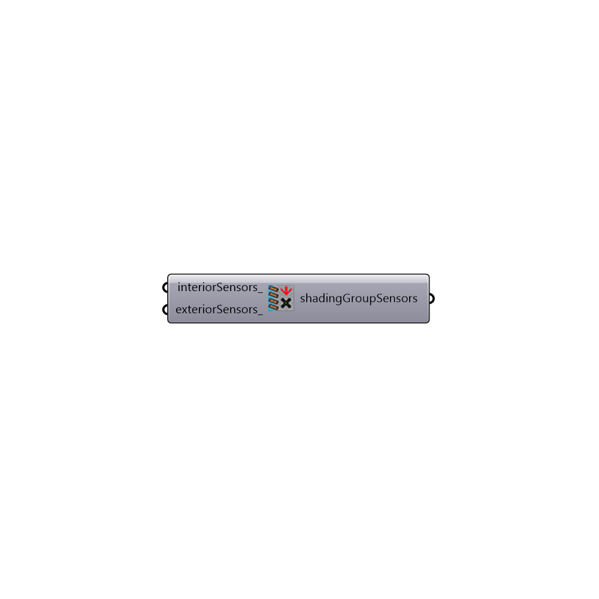

##  Daysim shading group sensors - [[source code]](https://github.com/mostaphaRoudsari/honeybee/tree/master/src/Honeybee_Daysim%20shading%20group%20sensors.py)

Daysim shading group sensors
 Read here for more information about Daysim sensors here: http://daysim.ning.com/page/daysim-header-file-keyword-sensor-file-info-1
 -
 

#### Inputs
* ##### interiorSensors [Optional]
Selected list of test points that indicates where occupants sit.
* ##### exteriorSensors [Optional]
Selected list of test points that indicates the location of the exterior sensor. Exterior sensor will be only used if you are using the glare control.

#### Outputs
* ##### shadingGroupSensors
Shading group sensors to be used for read Daysim result

[Check Hydra Example Files for Daysim shading group sensors](https://hydrashare.github.io/hydra/index.html?keywords=Honeybee_Daysim shading group sensors)