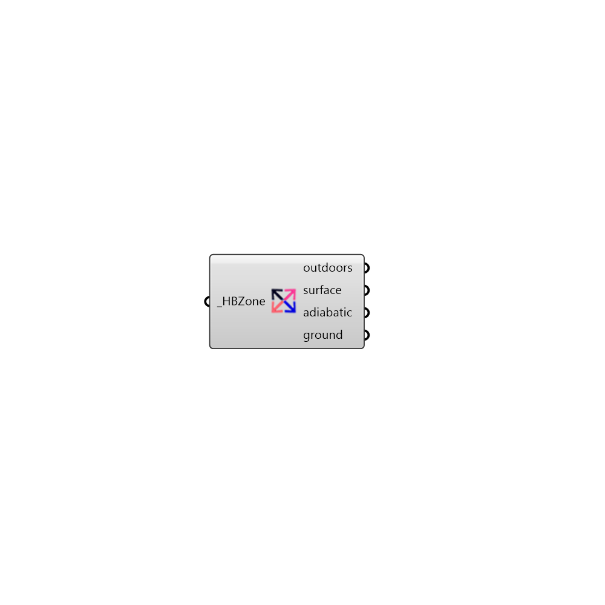

##  Decompose Based On Boundary Condition - [[source code]](https://github.com/ladybug-tools/honeybee-legacy/tree/master/src/Honeybee_Decompose%20Based%20On%20Boundary%20Condition.py)

Decompose zone surfaces by boundary condition
 -
 

#### Inputs
* ##### HBZone [Required]
Honeybee Zone

#### Outputs
* ##### outdoors
A list of surfaces which has outdoors boundary condition
* ##### surface
A list of surfaces which has surface boundary condition
* ##### adiabatic
A list of surfaces which has adiabatic boundary condition
* ##### ground
A list of surfaces which has ground boundary condition

[Check Hydra Example Files for Decompose Based On Boundary Condition](https://hydrashare.github.io/hydra/index.html?keywords=Honeybee_Decompose Based On Boundary Condition)