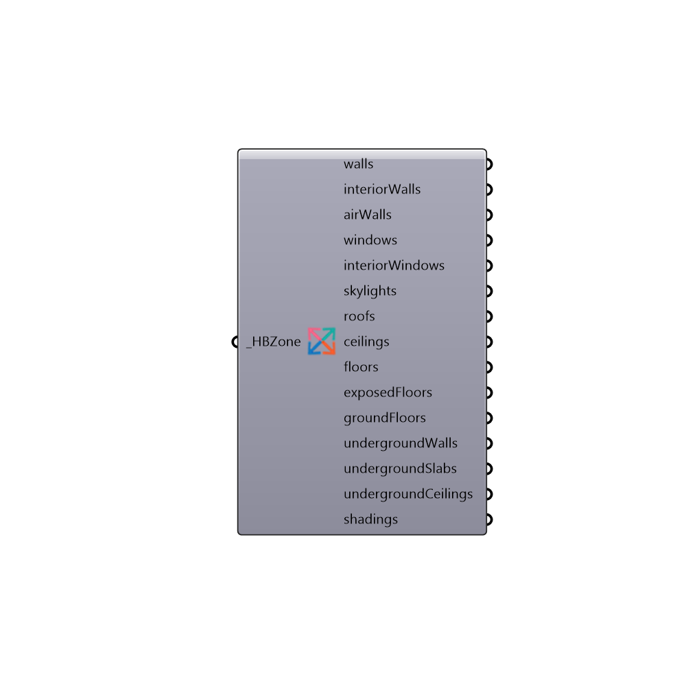

##  Decompose Based On Type - [[source code]](https://github.com/ladybug-tools/honeybee-legacy/tree/master/src/Honeybee_Decompose%20Based%20On%20Type.py)

Use this component to break down the geometry of your zone by the surface type.  This is useful for previewing your zones in the rhino scene and making sure that each surface of your zones has the correct surface type.
 -
 

#### Inputs
* ##### HBZone [Required]
Honeybee Zones for which you want to preview the different surface types.

#### Outputs
* ##### walls
A list of the exterior walls of your zones as breps.  Connect to a Grasshopper "Preview" component to add color to the breps.
* ##### interiorWalls
A list of the interior walls of your zones as breps.  Connect to a Grasshopper "Preview" component to add color to the breps.
* ##### airWalls
A list of the air walls of your zones as breps.  Connect to a Grasshopper "Preview" component to add color to the breps.
* ##### windows
A list of windows of your zones as breps.  Connect to a Grasshopper "Preview" component to add color to the breps.
* ##### interiorWindows
A list of interior windows of your zones as breps.  Connect to a Grasshopper "Preview" component to add color to the breps.
* ##### skylights
A list of skylights of your zones as breps.  Connect to a Grasshopper "Preview" component to add color to the breps.
* ##### roofs
A list of roofs of your zones as breps.  Connect to a Grasshopper "Preview" component to add color to the breps.
* ##### ceilings
A list of ceilings of your zones as breps.  Connect to a Grasshopper "Preview" component to add color to the breps.
* ##### floors
A list of floors of your zones as breps.  Connect to a Grasshopper "Preview" component to add color to the breps.
* ##### exposedFloors
A list of floors exposed to the outside air as breps.  Connect to a Grasshopper "Preview" component to add color to the breps.
* ##### groundFloors
A list of ground floors of your zones as breps.  Connect to a Grasshopper "Preview" component to add color to the breps.
* ##### undergroundWalls
A list of underground walls of your zones as breps.  Connect to a Grasshopper "Preview" component to add color to the breps.
* ##### undergroundSlabs
A list of underground floor slabs of your zones as breps.  Connect to a Grasshopper "Preview" component to add color to the breps.
* ##### undergroundCeilings
A list of underground ceilings of your zones as breps.  Connect to a Grasshopper "Preview" component to add color to the breps.
* ##### shadings
A list of shadings of your zones as breps.  Connect to a Grasshopper "Preview" component to add color to the breps.

[Check Hydra Example Files for Decompose Based On Type](https://hydrashare.github.io/hydra/index.html?keywords=Honeybee_Decompose Based On Type)