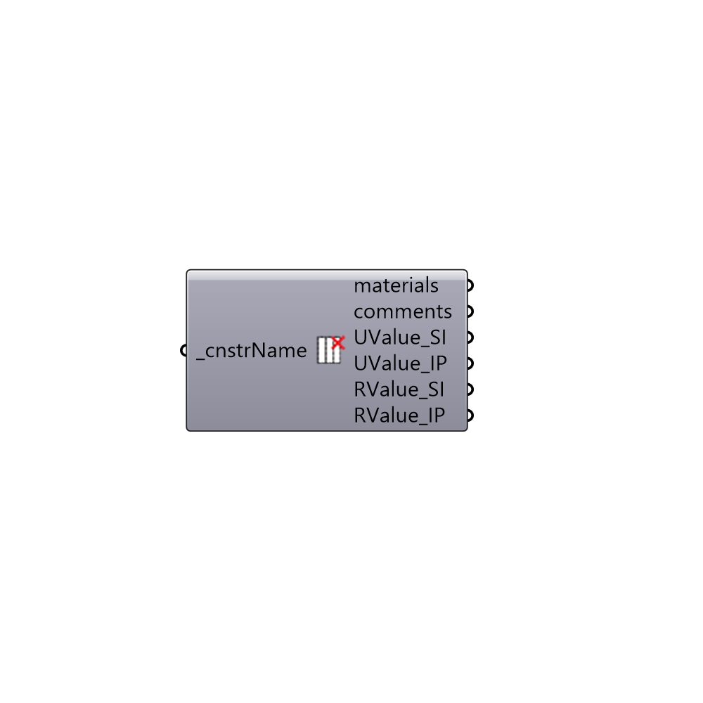

##  Decompose EP Construction - [[source code]](https://github.com/mostaphaRoudsari/honeybee/tree/master/src/Honeybee_Decompose%20EP%20Construction.py)

Decompose EnergyPlus Construction
 -
 

#### Inputs
* ##### cnstrName [Required]
EnergyPlus construction name

#### Outputs
* ##### materials
List of materials (from outside to inside)
* ##### comments
Comments for each layer of materials if any
* ##### UValue_SI
U-value of the construction in W/m2-K.  Note that this U-value does not include the resistance of air films on either side of the construction and this resistance is typically included in U-values used by manufacturers.  Use the "Honeybee_R-Value With Air Films" component to account for these air films.
* ##### UValue_IP
U-value of the construction in Btu/h·ft2·°F.  Note that this U-value does not include the resistance of air films on either side of the construction and this resistance is typically included in U-values used by manufacturers.  Use the "Honeybee_R-Value With Air Films" component to account for these air films.
* ##### RValue_SI
R-value of the construction in m2-K/W.
* ##### RValue_IP
R-value of the construction in h·ft2·°F/Btu.

[Check Hydra Example Files for Decompose EP Construction](https://hydrashare.github.io/hydra/index.html?keywords=Honeybee_Decompose EP Construction)