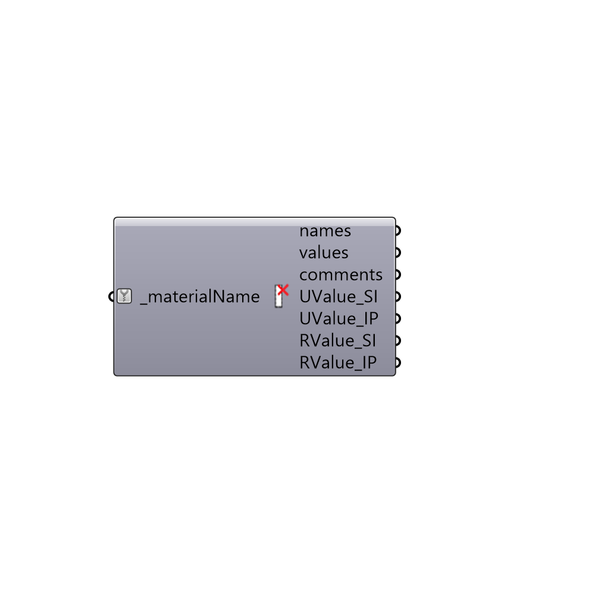

##  Decompose EP Material

Decompose EnergyPlus Material
 -
 

#### Inputs
* ##### materialName [Required]
EnergyPlus material name

#### Outputs
* ##### names
Script variable DecomposeEPMaterial
* ##### values
Script output values.
* ##### comments
Comments for each layer of materials if any
* ##### UValue_SI
U value of the construction in W/m2.K
* ##### UValue_IP
U value of the construction in Btu/h·ft2·°F
* ##### RValue_SI
Script variable DecomposeEPMaterial
* ##### RValue_IP
Script variable DecomposeEPMaterial

[Check Hydra Example Files for Decompose EP Material](https://hydrashare.github.io/hydra/index.html?keywords=Honeybee_Decompose EP Material)