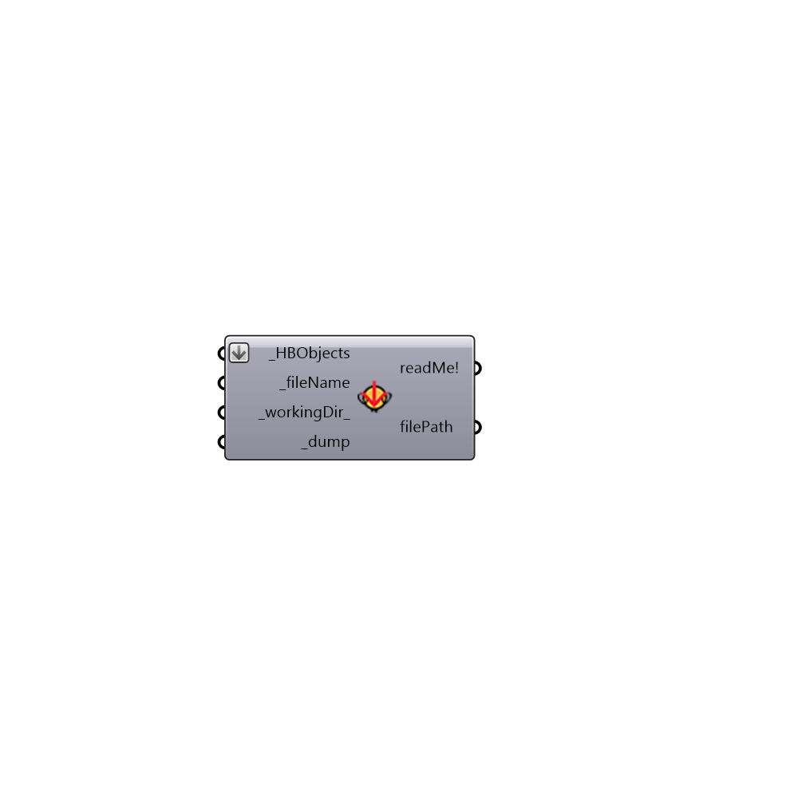

##  Dump Honeybee Objects

Dump Honeybee Objects
 Use this component to dump Honeybee objects to a file on your system.
 You can use load Honeybee objects to load the file to Grasshopper.
 WARNING: This component does not write custom schedules or materials within the file but it does write the names of the constructions and schedules.
 Accordingly, to properly load objects agian, you must connect the full strings of these objects to a "Add to EnergyPlus Library" component in any GH cript that loads the HBZones from the file.
 -
 

#### Inputs
* ##### HBObjects [Required]
A list of Honeybee objects
* ##### fileName [Required]
A name for the file to which HBObjects will be written (e.g. 20ZonesExample.HB).
* ##### workingDir [Default]
An optional working directory into which the HBZones will be written.  The default is set to C:\ladybug.
* ##### dump [Required]
Set to True to save the objects to file

#### Outputs
* ##### readMe!
...
* ##### filePath
The location of the file where the HBZones have been saved.

[Check Hydra Example Files for Dump Honeybee Objects](https://hydrashare.github.io/hydra/index.html?keywords=Honeybee_Dump Honeybee Objects)