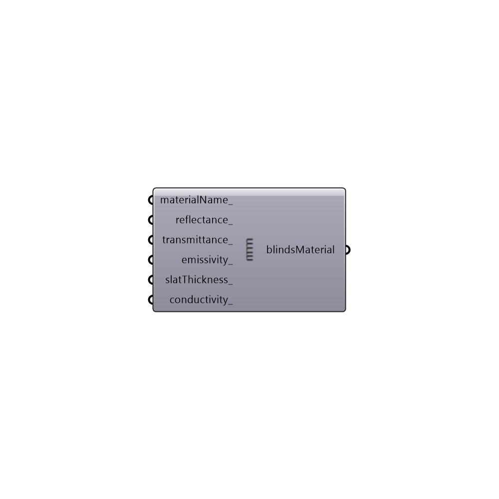

##  EnergyPlus Blinds Material

Use this component to create a cutom material for blinds, which can be plugged into the "Honeybee_Zone Shade Generator" component.
 _
 The output of this component can also be used in a construction but note that default values will be applied for blind thicknesses and angles of the slats.  In order to adjust these characteristics of the blind material, you should plug the output here into a "Honeybee_Zone Shades" component.
 -
 

#### Inputs
* ##### materialName [Optional]
An optional name for the blind material.
* ##### reflectance [Optional]
A number between 0 and 1 that represents the front reflectance of the blind material.  The default value is set to 0.65.
* ##### transmittance [Optional]
A number between 0 and 1 that represents the transmittance of the blind material. The default value is set to 0 for a perfectly opaque shade.
* ##### emissivity [Optional]
A number between 0 and 1 that represents the emissivity of the blind material. The default value is set to 0.9 for a non-metalic shade.
* ##### slatThickness [Optional]
An optional number representing the thickness of each blind slat in millimeters.  The default is set to 0.25 mm for a very thin shade.
* ##### conductivity [Optional]
An optional number representing the conductivity of the blind material in W/m-K.  The default is set to 221 W/m-K.

#### Outputs
* ##### blindsMaterial
A blind material that can be plugged into the ZoneShades component.

[Check Hydra Example Files for EnergyPlus Blinds Material](https://hydrashare.github.io/hydra/index.html?keywords=Honeybee_EnergyPlus Blinds Material)