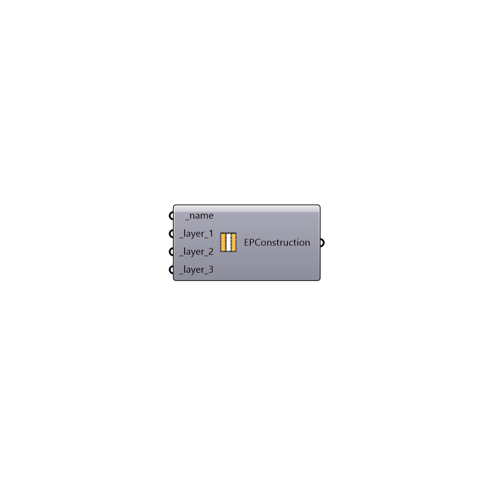

##  EnergyPlus Construction - [[source code]](https://github.com/mostaphaRoudsari/honeybee/tree/master/src/Honeybee_EnergyPlus%20Construction.py)

Use this component to make your own EnergyPlus construction.  Inputs can be either the name of a matterial form the Openstudio construction library or a custom material made with any of the EnergyPlus Material components.
 _
 Note that the last layer in the component is always the innermost layer and _layer_1 is always the outermost layer.
 _
 To add more layers in the construction, simply zoom into the component and hit the lowest "+" sign that shows up on the input side.  To remove layers from the construction, zoom into the component and hit the lowest "-" sign that shows up on the input side.
 -
 

#### Inputs
* ##### name [Required]
A text name for your custom construction. This is what you will use as an input to other components in order to reference your custom construction.
* ##### layer_1 [Required]
The first and outer-most layer of your construction.
* ##### layer_2 [Required]
The second outer-most layer of your construction.
* ##### layer_3 [Required]
The third outer-most layer of your construction.

#### Outputs
* ##### EPConstruction
An EnergyPlus construction that can be plugged into the "Honeybee_Add to EnergyPlus Library" component in order to write the construction into the project library.

[Check Hydra Example Files for EnergyPlus Construction](https://hydrashare.github.io/hydra/index.html?keywords=Honeybee_EnergyPlus Construction)