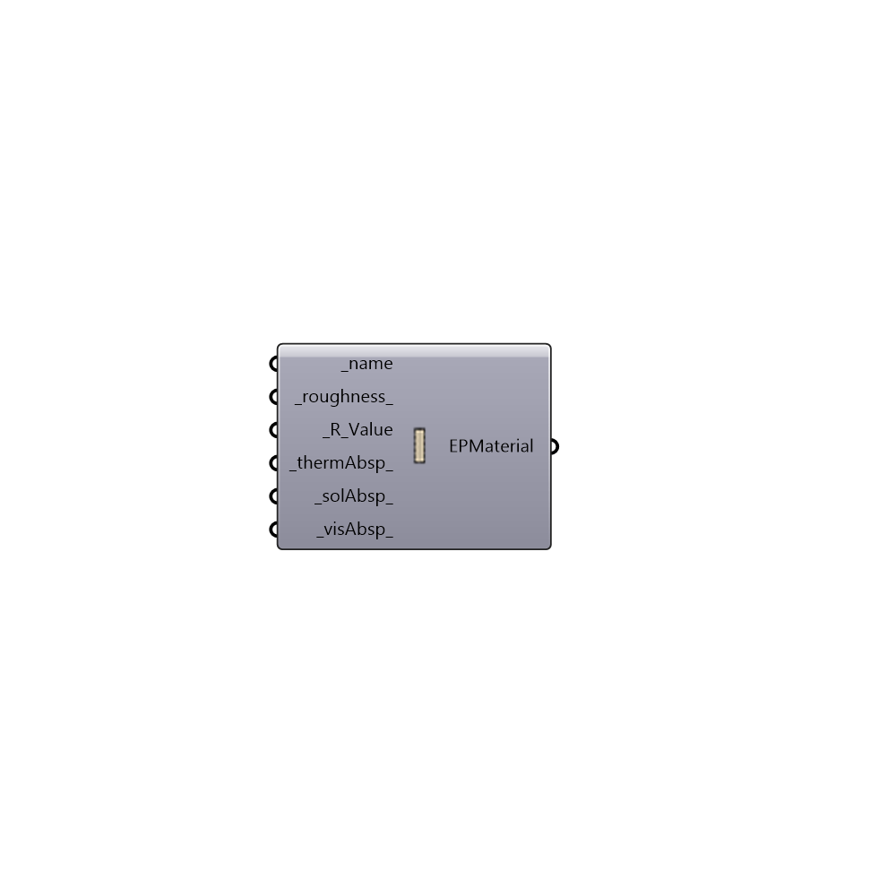

##  EnergyPlus NoMass Opaque Material - [[source code]](https://github.com/mostaphaRoudsari/honeybee/tree/master/src/Honeybee_EnergyPlus%20NoMass%20Opaque%20Material.py)

Use this component to create a custom opaque material that has no mass, which can be plugged into the "Honeybee_EnergyPlus Construction" component.
 _
 It is important to note that this component creates a material with no mass and, because of this, the accuracy of the component is not as great as a material that has mass.  However, this component is very useful if you only have an R-value for a material (or a construction) and you know that the mass is relatively small.
 _
 If you want to create a material that accounts for mass, you should use the "Honeybee_EnergyPlus Window Material" component.
 -
 

#### Inputs
* ##### name [Required]
A text name for your NoMass Opaque Material.
* ##### roughness [Default]
A text value that indicated the roughness of your material.  This can be either "VeryRough", "Rough", "MediumRough", "MediumSmooth", "Smooth", and "VerySmooth".  The default is set to "Rough".
* ##### R_Value [Required]
A number representing the R-Value of the material in m2-K/W.
* ##### thermAbsp [Default]
An number between 0 and 1 that represents the thermal abstorptance of the material.  The default is set to 0.9, which is common for most non-metallic materials.
* ##### solAbsp [Default]
An number between 0 and 1 that represents the abstorptance of solar radiation by the material.  The default is set to 0.7, which is common for most non-metallic materials.
* ##### visAbsp [Default]
An number between 0 and 1 that represents the abstorptance of visible light by the material.  The default is set to 0.7, which is common for most non-metallic materials.

#### Outputs
* ##### EPMaterial
A no-mass opaque material that can be plugged into the "Honeybee_EnergyPlus Construction" component.

[Check Hydra Example Files for EnergyPlus NoMass Opaque Material](https://hydrashare.github.io/hydra/index.html?keywords=Honeybee_EnergyPlus NoMass Opaque Material)