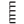
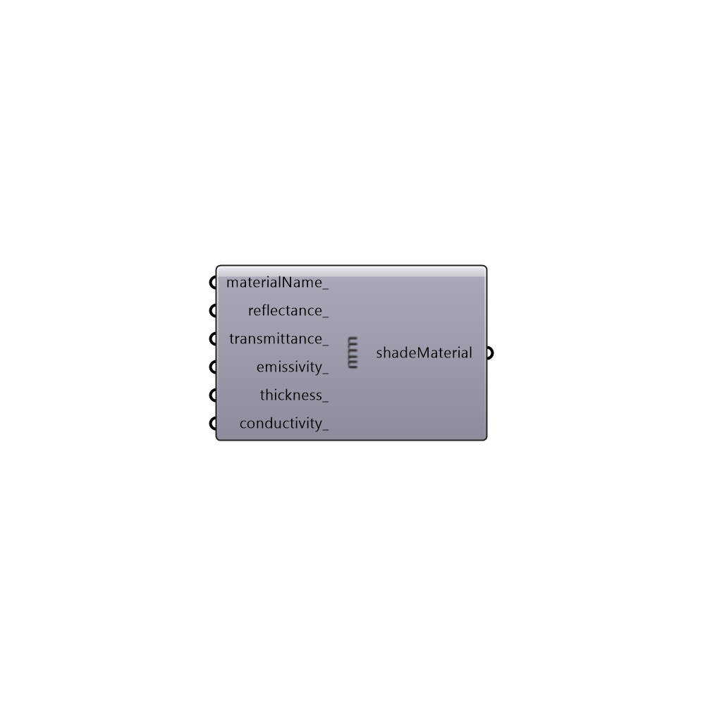

##  EnergyPlus Shade Material - [[source code]](https://github.com/mostaphaRoudsari/honeybee/tree/master/src/Honeybee_EnergyPlus%20Shade%20Material.py)

Use this component to create a custom material for shades, which can be plugged into the "Honeybee_EnergyPlus Window Shade Generator" component.
 _
 In order to apply the material to a window shade and adjust geometric characteristics of the shade, you should plug the output of this component into a "Honeybee_EnergyPlus Window Shade Generator" component.
 _
 Note that the material characteristics here can refer to either blind slats, roller shades, perforated exterior metal screens, or the properties of electrochromic glazing in an "on" state.
 -
 

#### Inputs
* ##### materialName [Optional]
An optional name for the shade material.
* ##### reflectance [Optional]
A number between 0 and 1 that represents the front reflectance of the shade material.  The default value is set to 0.65.
* ##### transmittance [Optional]
A number between 0 and 1 that represents the transmittance of the shade material. The default value is set to 0 for a perfectly opaque shade.
* ##### emissivity [Optional]
A number between 0 and 1 that represents the emissivity of the shade material. The default value is set to 0.9 for a non-metalic shade.
* ##### thickness [Optional]
An optional number representing the thickness of the shade in meters.  For blinds, this is the thickness of each blind slat and, for roller shades and screens, this is the thickness of the fabric or screen material.  For electrochromic windows, this variable is discounted since window materials with n mass are used. The default is set to 0.00025 m for a very thin shade.
* ##### conductivity [Optional]
An optional number representing the conductivity of the shade material in W/m-K.  The default is set to 221 W/m-K.

#### Outputs
* ##### shadeMaterial
A shade material that can be plugged into the ZoneShades component.

[Check Hydra Example Files for EnergyPlus Shade Material](https://hydrashare.github.io/hydra/index.html?keywords=Honeybee_EnergyPlus Shade Material)