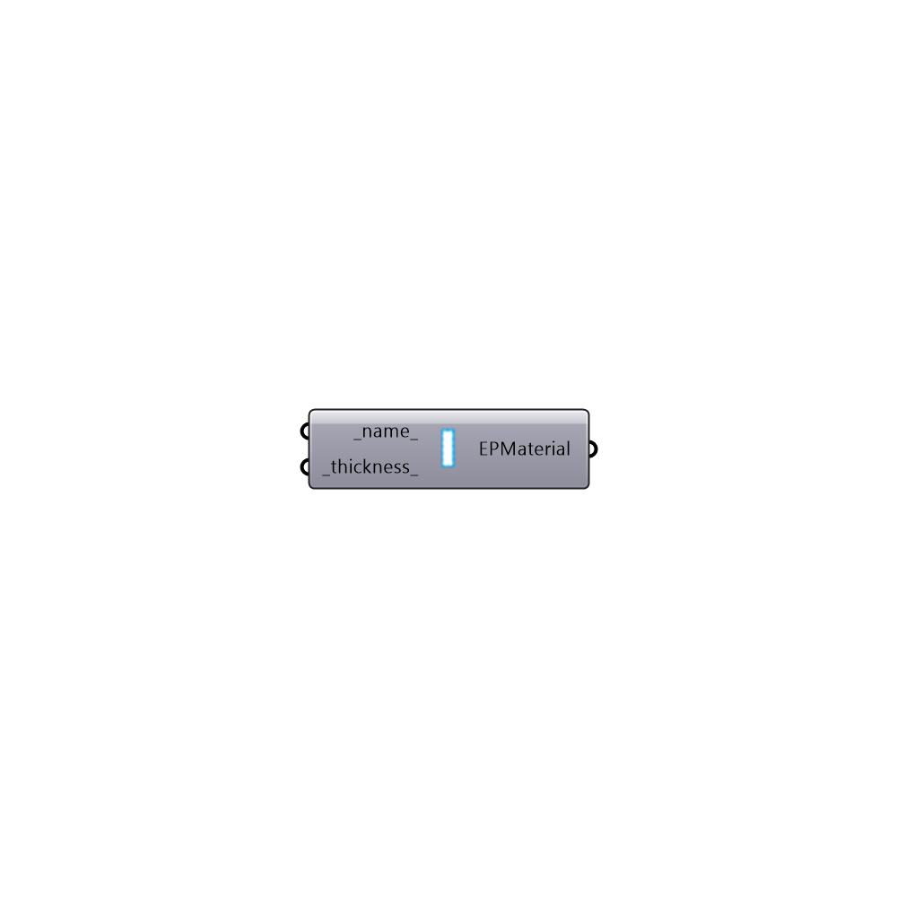

##  EnergyPlus Window Air Gap - [[source code]](https://github.com/ladybug-tools/honeybee-legacy/tree/master/src/Honeybee_EnergyPlus%20Window%20Air%20Gap.py)

Use this component to create a custom material for a window air gap, which can be plugged into the "Honeybee_EnergyPlus Construction" component.
 _
 It is important to note that this component only creates gaps of air and not other gasses.
 Also, the material out of this component represents only a single layer of air, which can be combined with the "Honeybee_EnergyPlus Glass Material" to make multi-pane windows.
 If you have specifications for a whole window element and not individual panes of glass and gas, you are better-off using the "Honeybee_EnergyPlus Window Material" component instead of this one.
 -
 

#### Inputs
* ##### name [Default]
Script variable EPWinAirGap
* ##### thickness [Default]
A number that represents the thickness of the air gap in meters.  The default is set to 0.0125 meters (1.25 cm).

#### Outputs
* ##### EPMaterial
A window air gap material that can be plugged into the "Honeybee_EnergyPlus Construction" component.

[Check Hydra Example Files for EnergyPlus Window Air Gap](https://hydrashare.github.io/hydra/index.html?keywords=Honeybee_EnergyPlus Window Air Gap)