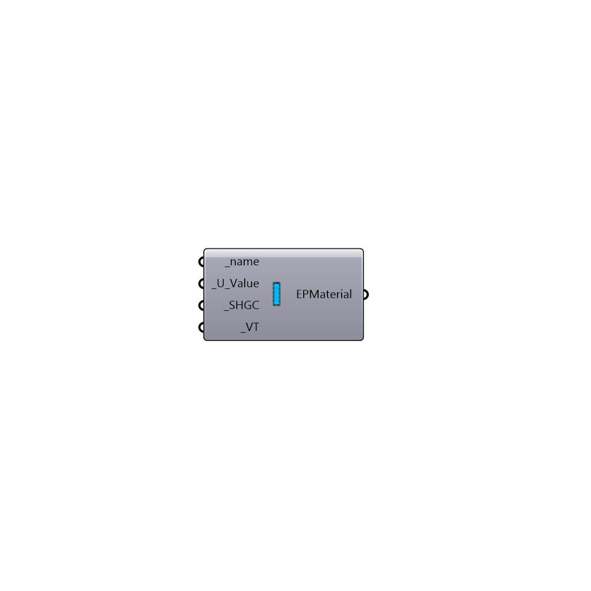

##  EnergyPlus Window Material

Use this component to create a custom window material that has no mass, which can be plugged into the "Honeybee_EnergyPlus Construction" component.
 _
 It is important to note that this component creates a material with no mass and that is meant to represent an entire window element (including all panes of glass and the frame).  Because of this, when you plug this material into the "Honeybee_EnergyPlys Construction" component, it is important that this is the only material connected.  Otherwise, E+ will crash when you try to run it.
 Also because of this, the accuracy of this material is not as great as a material that has mass.  However, this component is very useful if you only have a U-value, SHGC, and VT for a window construction and no other information.
 _
 If you want to create a material that accounts for mass, you should use the "Honeybee_EnergyPlus Glass Material" component and the "Honeybee_EnergyPlus Window Air Gap" to create a window construction with one or multiple panes.
 -
 

#### Inputs
* ##### name [Required]
A text name for your NoMass Window Material.
* ##### U_Value [Required]
A number representing the conductivity of the window in W/m-K. This is the rated (NFRC) value for U-factor under winter heating conditions. As a result, the U-Value input here should include the air films for a vertically-mounted product.
* ##### SHGC [Required]
A number between 0 and 1 that represents the solar heat gain coefficient (SHGC) of the window. The solar heat gain coeffieceint is essentially the fraction of solar radiation falling on the window that makes it through the glass (at normal incidence).  This number is usually very close to the visible transmittance (VT) for glass without low-e coatings but can be might lower for glass with low-e coatings.
* ##### VT [Required]
A number between 0 and 1 that represents the visible transmittance (VT) of the window. The visible transmittance is essentially the fraction of visible light falling on the window that makes it through the glass (at normal incidence).  This number is usually very close to the solar heat gain coefficent (SHGC) for glass without low-e coatings but can be might higher for glass with low-e coatings.

#### Outputs
* ##### EPMaterial
A no-mass window material that can be plugged into the "Honeybee_EnergyPlus Construction" component.

[Check Hydra Example Files for EnergyPlus Window Material](https://hydrashare.github.io/hydra/index.html?keywords=Honeybee_EnergyPlus Window Material)