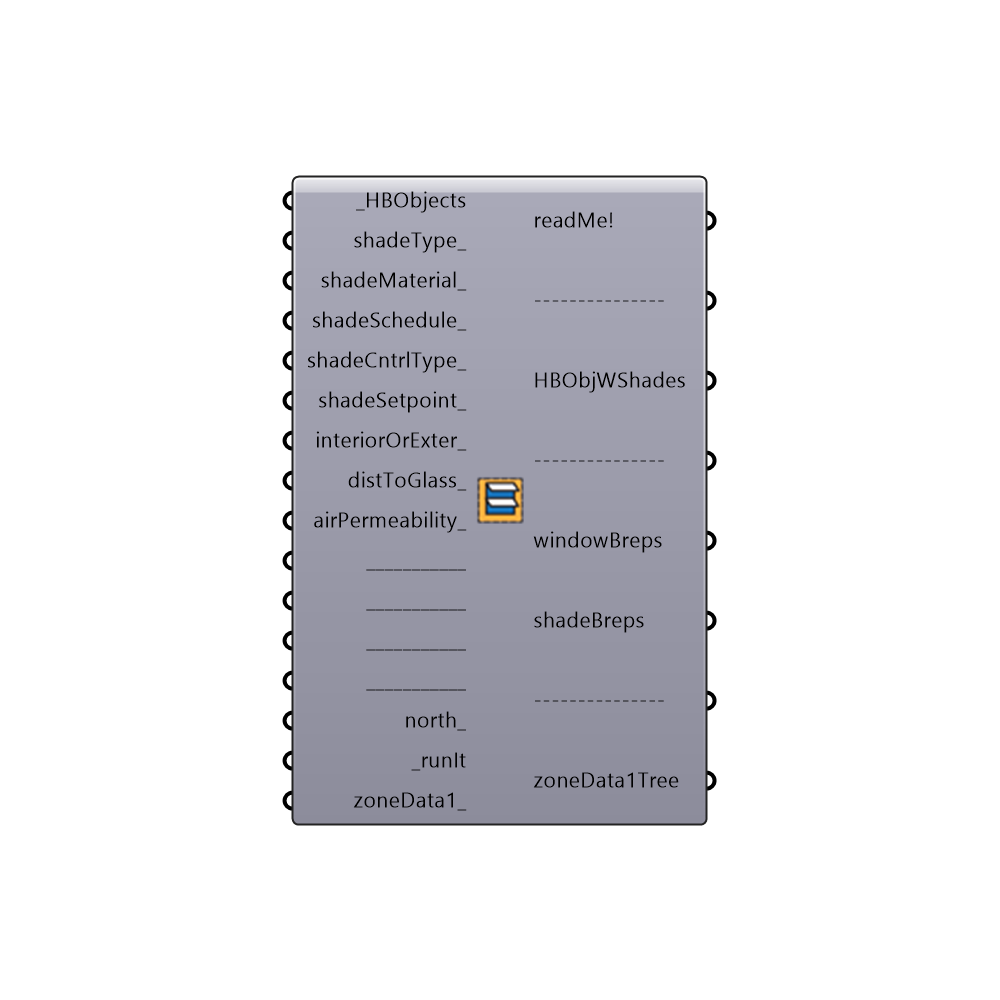

##  EnergyPlus Window Shade Generator

Use this component to generate shades for Honeybee zone windows. The component has two main uses:
 _
 The first is that it can be used to assign blind objects to HBZones prior to simulation.  These blinds can be dynamically controlled via a schedule.  Note that shades created this way will automatically be assigned to the zone and the windowBreps and shadeBreps outputs are just for visualization.
 _
 The second way to use the component is to create test shade areas for shade benefit evaluation after an energy simulation has already been run.  In this case, the component helps keep the data tree paths of heating, cooling and beam gain synced with that of the zones and windows.  For this, you would take imported EnergyPlus results and hook them up to the "zoneData" inputs and use the output "zoneDataTree" in the shade benefit evaluation.
 -
 

#### Inputs
* ##### HBObjects [Required]
The HBZones out of any of the HB components that generate or alter zones.  Note that these should ideally be the zones that are fed into the Run Energy Simulation component.  Zones read back into Grasshopper from the Import idf component will not align correctly with the EP Result data.
* ##### blindsMaterial [Optional]
An optional blind material from the blind material component.  If no material is connected here, the component will automatically assign a material of 0.65 solar reflectance, 0 transmittance, 0.9 emittance, 0.25 mm thickness, 221 W/mK conductivity.
* ##### blindsSchedule [Optional]
An optional schedule to raise and lower the blinds.  If no value is connected here, the blinds will assume the "ALWAYS ON" shcedule.
* ##### north [Optional]
Input a vector to be used as a true North direction or a number between 0 and 360 that represents the degrees off from the y-axis to make North.  The default North direction is set to the Y-axis (0 degrees).
* ##### depth [Required]
A number representing the depth of the shade to be generated on each window.  You can also input lists of depths, which will assign different depths based on cardinal direction.  For example, inputing 4 values for depths will assign each value of the list as follows: item 0 = north depth, item 1 = west depth, item 2 = south depth, item 3 = east depth.  Lists of vectors to be shaded can also be input and shades can be joined together with the mergeVectors_ input.
* ##### numOfShds [Required]
The number of shades to generated for each glazed surface.
* ##### distBetween [Required]
An alternate option to _numOfShds where the input here is the distance in Rhino units between each shade.
* ##### horOrVertical [Optional]
Set to "True" to generate horizontal shades or "False" to generate vertical shades. You can also input lists of horOrVertical_ input, which will assign different orientations based on cardinal direction.
* ##### shdAngle [Optional]
A number between -90 and 90 that represents an angle in degrees to rotate the shades.  The default is set to "0" for no rotation.  If you have vertical shades, use this to rotate them towards the South by a certain value in degrees.  If applied to windows facing East or West, tilting the shades like this will let in more winter sun than summer sun.  If you have horizontal shades, use this input to angle shades downward.  You can also put in lists of angles to assign different shade angles to different cardinal directions.
* ##### interiorOrExter [Optional]
Set to "True" to generate Shades on the interior and set to "False" to generate shades on the exterior.  The default is set to "False" to generate exterior shades.
* ##### distToGlass [Optional]
A number representing the offset distance from the glass to make the shades.
* ##### runIt [Required]
Set boolean to "True" to run the component and generate shades.
* ##### zoneData1 [Optional]
Optional zone data for the HBZones_ that will be aligned with the generated windows.  Use this to align data like heating load, cooling load or beam gain for a shade benefit simulation with the generated shades.
* ##### zoneData2 [Optional]
Optional zone data for the HBZones_ that will be aligned with the generated windows.  Use this to align data like heating load, cooling load or beam gain for a shade benefit simulation with the generated shades.
* ##### zoneData3 [Optional]
Optional zone data for the HBZones_ that will be aligned with the generated windows.  Use this to align data like heating load, cooling load or beam gain for a shade benefit simulation with the generated shades.

#### Outputs
* ##### readMe!
...
* ##### HBObjWShades
The HBZones with the assigned shading (ready to be simulated).
* ##### windowBreps
Breps representing each window of the zone.  These can be plugged into a shade benefit evaulation as each window is its own branch of a grasshopper data tree.
* ##### shadeBreps
Breps representing each shade of the window.  These can be plugged into a shade benefit evaulation as each window is its own branch of a grasshopper data tree.  Alternatively, they can be plugged into an EnergyPlus simulation with the "Honeybee_EP Context Surfaces" component.
* ##### zoneData1Tree
Data trees of the zoneData1_, which align with the branches for each window above.
* ##### zoneData2Tree
Data trees of the zoneData2_, which align with the branches for each window above.
* ##### zoneData3Tree
Data trees of the izoneData3_, which align with the branches for each window above.

[Check Hydra Example Files for EnergyPlus Window Shade Generator](https://hydrashare.github.io/hydra/index.html?keywords=Honeybee_EnergyPlus Window Shade Generator)