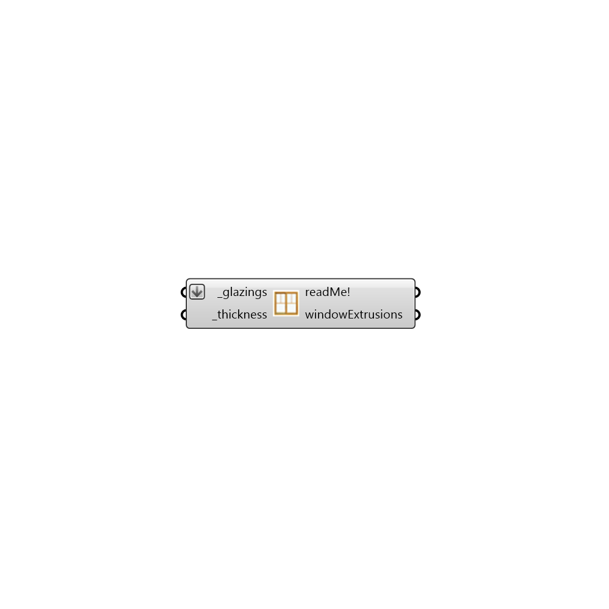

##  Extrude Windows

Extrude pseudo walls from window polygons. This component has only been tested with rectangular windows.
 -
 

#### Inputs
* ##### glazings [Required]
Any number of glazing polygons.
* ##### thickness [Required]
Thickness of the window. Can be a single number or a list of numbers. If its a list then the list should be equal to the number of glazings.

#### Outputs
* ##### readMe!
The execution information, as output and error streams
* ##### windowExtrusions
Geometric representations of glazing walls.

[Check Hydra Example Files for Extrude Windows](https://hydrashare.github.io/hydra/index.html?keywords=Honeybee_Extrude Windows)