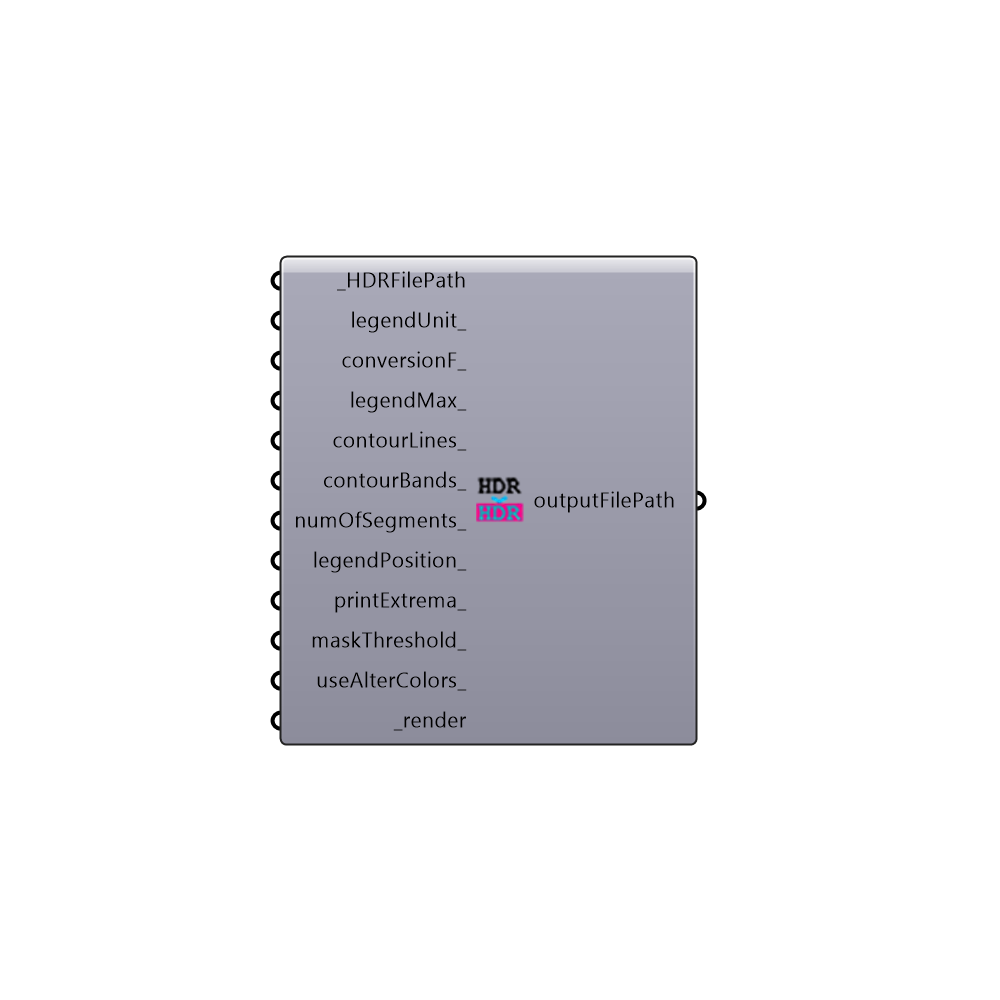

##  FalseColor

False Color
 -
 

#### Inputs
* ##### HDRFilePath [Required]
Path to an HDR image file
* ##### legendUnit [Optional]
Unit of the legend (e.g. lux, cd/m2,...)
* ##### conversionF [Optional]
Conversion factor for the results. Default is 179.
* ##### legendMax [Optional]
Maximum bound for the legend
* ##### contourLines [Optional]
Set to True ro render the image with colored lines
* ##### contourBands [Optional]
Script variable FalseColor
* ##### numOfSegments [Optional]
An interger representing the number of steps between the high and low boundary of the legend. Default value is set to 10.
* ##### legendPosition [Optional]
A number between 0 to 11 to set legend position to the given direction WS|W|WN|NW|N|NE|EN|E|ES|SE|S|SW
* ##### printExtrema [Optional]
Set to True to cause extrema points to be printed on the brightest and darkest pixels of the input picture.
* ##### maskThreshold [Optional]
Optional number for masking threshold. Pixels with values less than this number will be rendered in black.
* ##### useAlterColors [Optional]
Set to True to use the alternate colorset.
* ##### render [Required]
Set to True to render the new image

#### Outputs
* ##### outputFilePath
Path to the result HDR file

[Check Hydra Example Files for FalseColor](https://hydrashare.github.io/hydra/index.html?keywords=Honeybee_FalseColor)