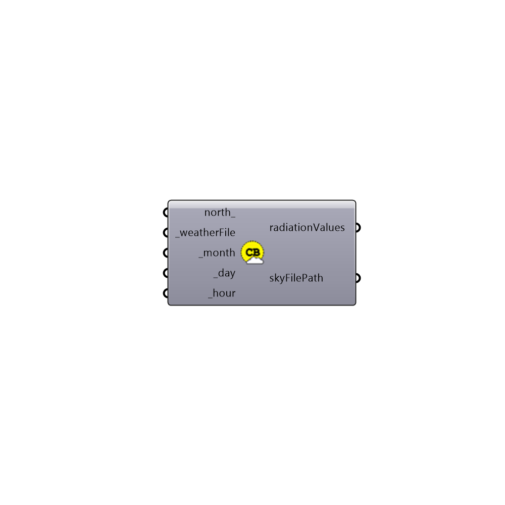

##  Generate Climate Based Sky

Genrate Climate Based Sky
 This component generate a climate based sky for any hour of the year
 -
 

#### Inputs
* ##### north [Optional]
Input a vector to be used as a true North direction for the sun path or a number between 0 and 360 that represents the degrees off from the y-axis to make North.  The default North direction is set to the Y-axis (0 degrees).
* ##### weatherFile [Required]
epw weather file address on your system
* ##### month [Required]
Month of the study [1-12]
* ##### day [Required]
Day of the study [1-31]
* ##### hour [Required]
Hour of the study [1-24]

#### Outputs
* ##### radiationValues
Direct and diffuse radiation of the sky
* ##### skyFilePath
Sky file location on the local drive

[Check Hydra Example Files for Generate Climate Based Sky](https://hydrashare.github.io/hydra/index.html?keywords=Honeybee_Generate Climate Based Sky)