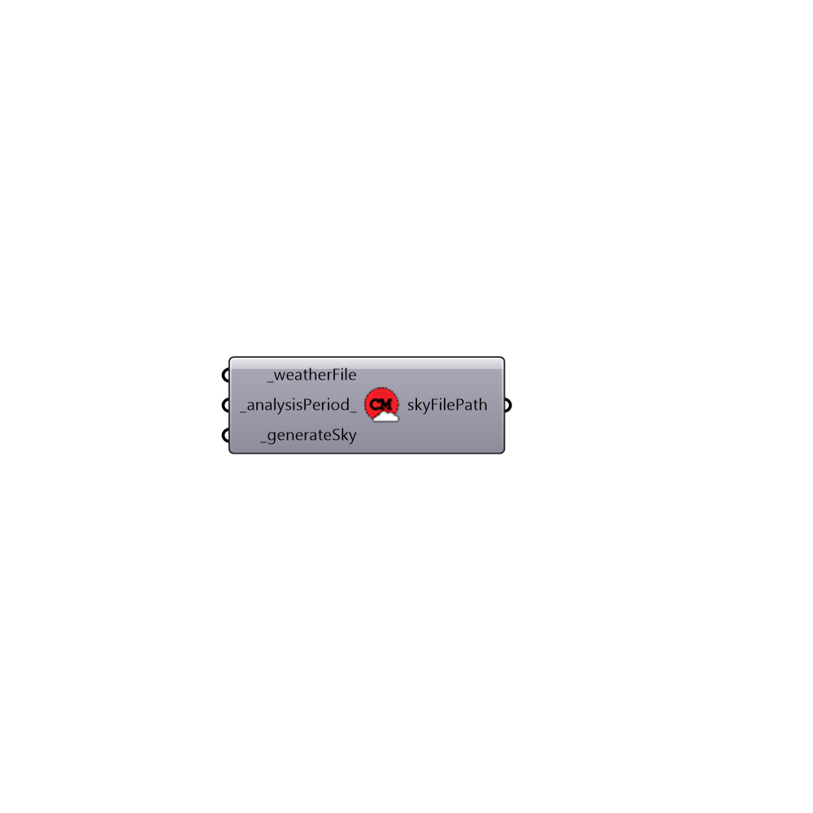

##  Generate Cumulative Sky - [[source code]](https://github.com/ladybug-tools/honeybee-legacy/tree/master/src/Honeybee_Generate%20Cumulative%20Sky.py)

This component generate a cumulative sky using GenCumulativeSky.exe. Only and only use it for radiation analysis (no daylighting!)
 GenCumulativeSky is developed by Darren Robinson and Andrew Stone, and modified by Christoph Reinhart.
 For more information, reference: http://www.solemma.net/references/PLEA2004_RobinsonAndStone.pdf
 The first time you use this component, you need to be connected to the internet so the component can download GenCumulativeSky.exe to the working directory.
 -
 

#### Inputs
* ##### weatherFile [Required]
epw weather file address on your system
* ##### analysisPeriod [Default]
Indicates the analysis period. An annual study will be run if this input is not provided by the user
* ##### generateSky [Required]
Set boolean to True to run the component

#### Outputs
* ##### skyFilePath
Sky file location on the local drive

[Check Hydra Example Files for Generate Cumulative Sky](https://hydrashare.github.io/hydra/index.html?keywords=Honeybee_Generate Cumulative Sky)