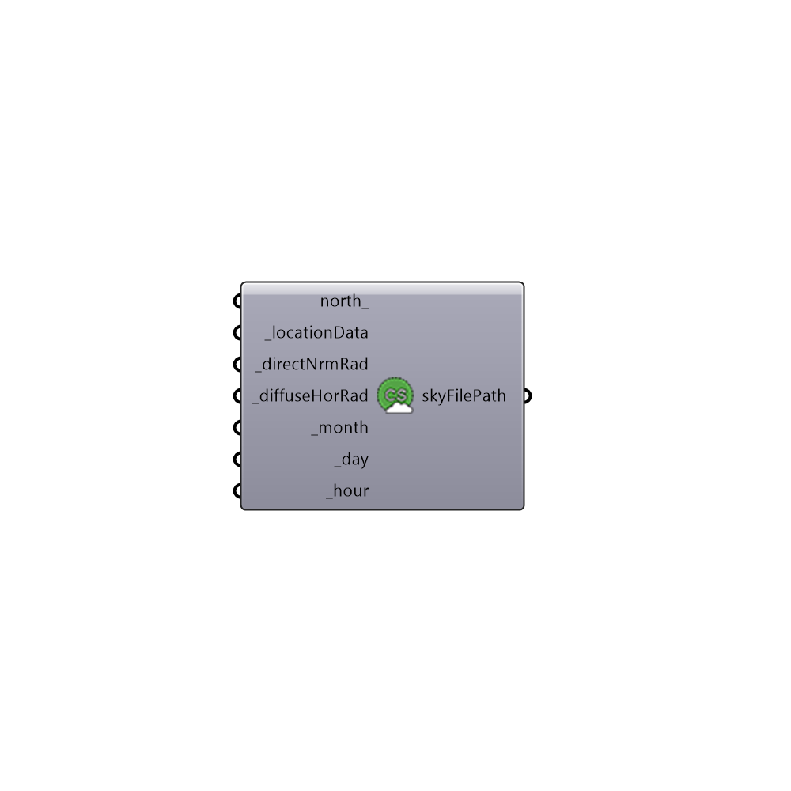

##  Generate Custom Sky

Genrate Custom Sky
 This component generate a custom sky based on user's input
 -
 

#### Inputs
* ##### north [Optional]
Input a vector to be used as a true North direction for the sun path or a number between 0 and 360 that represents the degrees off from the y-axis to make North.  The default North direction is set to the Y-axis (0 degrees).
* ##### locationData [Required]
The output from the importEPW or constructLocation component.  This is essentially a list of text summarizing a location on the earth.
* ##### directNrmRad [Required]
Direct Normal Radiation in Wh/m2
* ##### diffuseHorRad [Required]
Diffuse Horizontal Radiation in Wh/m2
* ##### month [Required]
Month of the study [1-12]
* ##### day [Required]
Day of the study [1-31]
* ##### hour [Required]
Hour of the study [1-24]

#### Outputs
* ##### skyFilePath
Sky file location on the local drive

[Check Hydra Example Files for Generate Custom Sky](https://hydrashare.github.io/hydra/index.html?keywords=Honeybee_Generate Custom Sky)