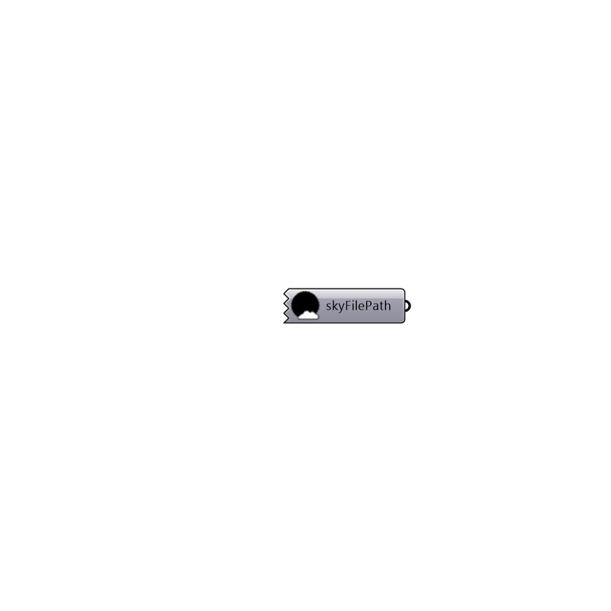

##  Generate Dark Sky

This component generates a dark sky with 0 illuminance.
 It's useful for lighting (and not daylighting) simulation with honeybee.
 -
 

#### Inputs

#### Outputs
* ##### skyFilePath
Sky file location on the local drive

[Check Hydra Example Files for Generate Dark Sky](https://hydrashare.github.io/hydra/index.html?keywords=Honeybee_Generate Dark Sky)