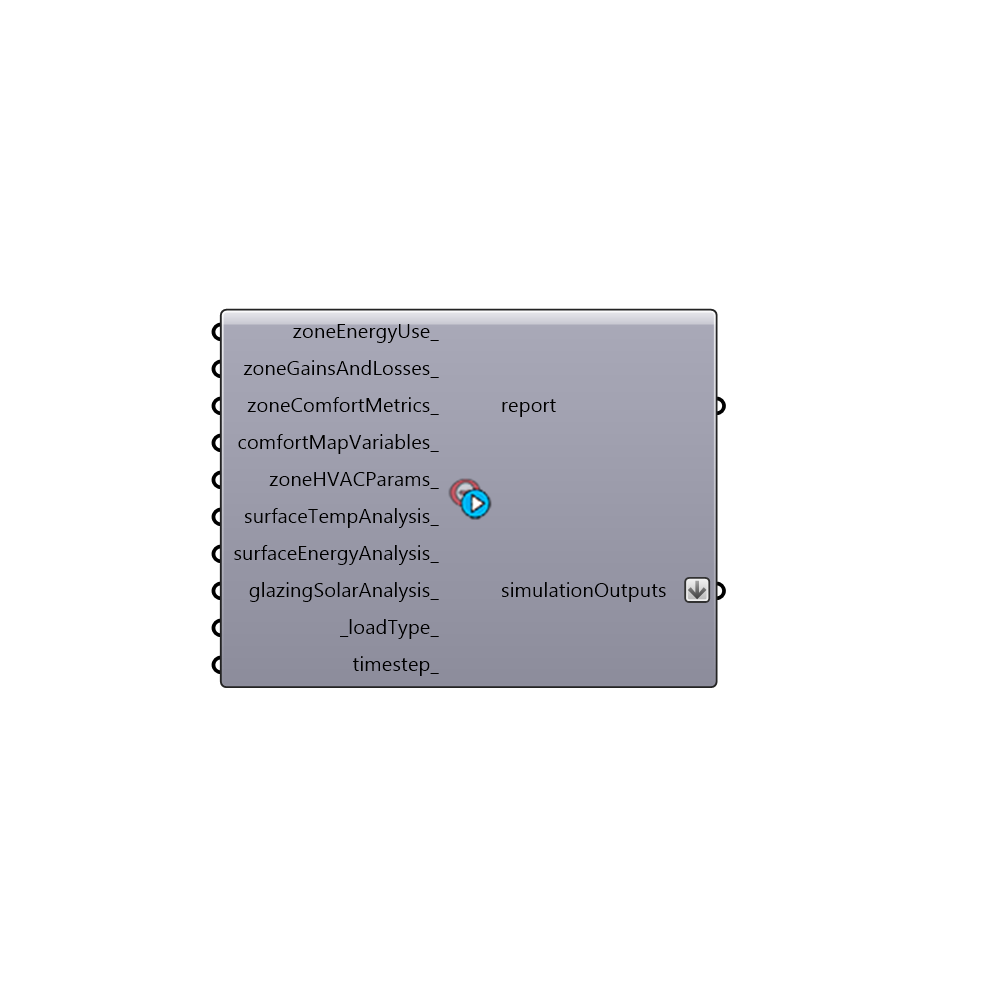

##  Generate EP Output

This component helps select simulation outputs that can be hooked into the "Honyebee_Export to OpenStudio" component.  Outputs are taken from here:
 http://bigladdersoftware.com/epx/docs/8-3/input-output-reference/
 _
 You can also use the "Honeybee_Read Result Dictionary" component after running a simulation to get a list of all possible outputs that you can request from a given simulation.
 -
 

#### Inputs
* ##### zoneEnergyUse [Optional]
Set to "True" to have EnergyPlus solve for basic building energy use such as heating, cooling, electricity for lights and electricity for plug loads for each zone.
* ##### zoneGainsAndLosses [Optional]
Set to "True" to have EnergyPlus solve for building gains and losses such as people gains, solar gains and infiltration losses/gains.
* ##### zoneComfortMetrics [Optional]
Set to "True" to have EnergyPlus solve for the mean air temperature, mean radiant temperature, operative temperature, and relative humidity of each zone.
* ##### comfortMapVariables [Optional]
Set to "True" to have EnergyPlus solve for the air flow and air heat gain of each zone, which is needed for the comfort map air stratification calculation.
* ##### zoneHVACParams [Optional]
Set to "True" to have EnergyPlus solve for the fractions of heating/cooling loads that are latent vs. sensible as well as the the flow rate and temperature of supply air into each zone.
* ##### surfaceTempAnalysis [Optional]
Set to "True" to have EnergyPlus solve for the interior and exterior surface temperatures of the individual surfaces of each zone.
* ##### surfaceEnergyAnalysis [Optional]
Set to "True" to have EnergyPlus solve for the gains and losses through the individual surfaces of each zone.
* ##### glazingSolarAnalysis [Optional]
Set to "True" to have EnergyPlus solve for the transmitted beam, diffuse, and total solar gain through the individual window surfaces of each zone.  These outputs are needed for Energy Shade Benefit Analysis.
* ##### loadType [Default]
An integer or text value to set the type of load outputs requested (sensible, latent, total).  The default is set to "0 = Total" but you may want to change this to "1 = Sensible" for zone HVAC sizing, etc.  Choose from the following options:
 0 = Total
 1 = Sensible
 2 = Latent
* ##### timestep [Optional]
Specify a timestep by inputing the words 'hourly', 'daily', 'monthly' or 'annual'.  The default is set to hourly.

#### Outputs
* ##### report
Report!
* ##### simulationOutputs
EnergyPlus code that should be plugged into the "simulationOutputs" parameter of the "Honeybee_Export to OpenStudio" component.

[Check Hydra Example Files for Generate EP Output](https://hydrashare.github.io/hydra/index.html?keywords=Honeybee_Generate EP Output)